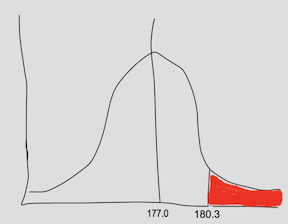

```{r setup, include=FALSE}
knitr::opts_chunk$set(echo = FALSE)
library(forcats) 
library(readxl)
library(dplyr)
library(ggplot2)
library(ggforce)
library(tidyr)
library(stringr)
library(knitr)
library(ggthemes)
library(wesanderson)
library(emo)
library(forcats)
library(ggmosaic)
library(ggridges)
library(kableExtra)
library(gridExtra)
library(ggrepel)
library(RColorBrewer)
library(plotly)
library(readr)
library(stringr)
library(infer)
library(emoGG)


yb_theme <-   theme(axis.text.x=element_text(size=16),
        axis.text.y=element_text(size=16),
        axis.title.x = element_text(size=18),
        axis.title.y = element_text(size=18),
        legend.title = element_text(size=18),
        legend.text = element_text(size=16),
        plot.title = element_text(size=22),
        strip.text =  element_text(size=18)) 


birth.weight <- data.frame( weight = seq(.25,14.75,.25) , 
                            count = c(0,0,1,9,5,8,17,25,12,20,21,27,
                                      28,33,24,57,65,98,107,161,189,
                                      310,393,611,837,1096,1273,1682,
                                      1684,1814,1520,1681,1220,1028,
                                      718,702,385,294,173,135,69,36,
                                      29,24,9,4,7,3,0,0,0,0,0,0,0,1,
                                      0,0,0))
mean.birth <- with(birth.weight, sum(weight * count)/sum(count))
sdev.birth <- with(birth.weight, sd(rep(weight , count)))
norm.birth <- dnorm(birth.weight$weight, mean = mean.birth, sdev.birth)
norm.birth <- (norm.birth/sum(norm.birth)) * sum(birth.weight$count)

temp.data<- read_delim("http://www.amstat.org/publications/jse/datasets/normtemp.dat.txt",
                       col_names = FALSE,delim = " ")%>% 
  mutate(X2 = as.numeric(X2), X3 = as.numeric(X3), X2 = case_when(X2 == 1~"male", X2 == 2~"female")) %>% 
  select(temp = X1, gender = X2, heart_rate = X3) 

temp.data.hist <- hist(temp.data$temp, breaks = seq(96,101,.3), plot=FALSE)
mean.temp <- mean(temp.data$temp)
sdev.temp <- sd(temp.data$temp)
norm.temp <- dnorm(temp.data.hist$mids, mean = mean.temp, sd = sdev.temp)
norm.temp <- (norm.temp/sum(norm.temp)) * length(temp.data$temp)
temp.data <- data.frame(temp = temp.data.hist$mids, count = temp.data.hist$counts)


egg.data <- c(5308, 3908, 5093, 5519, 3467, 5526, 5594, 8824, 5931, 
              3665, 4739,5587, 4735, 5350, 4851, 4726, 5912, 5852, 
              4410, 3838, 6317, 6059, 5790, 5786, 6418, 6363, 4309, 
              4861, 4477, 6182, 6133, 6819, 4727, 6370, 5757, 7232, 
              7368, 6757, 6959, 4323, 6708, 5171)
egg.data.hist <- hist(egg.data, breaks = seq(0,10000,500), plot=FALSE)
mean.egg <- mean(egg.data)
sdev.egg <- sd(egg.data)
norm.egg <- dnorm(egg.data.hist$mids, mean = mean.egg, sd = sdev.egg)
norm.egg <- (norm.egg/sum(norm.egg)) * length(egg.data)
egg.data <- data.frame(number_eggs = egg.data.hist$mids, count = egg.data.hist$counts)
```


## Key Learning  Goals  

Recognize that the normal distribution is common in nature (and why).  

Know how to parameterize a normal distribution. 

Know how to use the standard normal table & conduct a Z-transformation. 

Find the probability that a sample mean is within a given range. 

Explain the central limit theorem and its significance.


## Get to know the normal distribution   

The normal distribution (aka the "bell curve", aka the Gaussian) is incredibly common in the world!

It is also mathematically convenient. 

Therefore, much of statistics is based off of the normal distribution.  


## Sums are Normally Distributed    

Because most quantitative variables are sums (or averages) of a bunch of things, the normal distribution is incredibly common!  

**For example:**    

- Human height is realized as the addition of lot of genetic effects and a lot of environmental factors.          

- The distance a seed moves is the sum of a lot of wind currents.  


# Examples: The normal distribution in nature 


## Human Birth Weight

Birth weight is (roughly) normally distributed


```{r echo=FALSE, fig.height=4}
ggplot(data = birth.weight, aes(x = weight, y = count)) + 
  geom_bar(stat = 'identity', fill = "orange") +
  theme_classic()             +
  scale_y_continuous(expand = c(0, 0)) + 
  labs(title = "The distribution of human birth weight") +
  geom_line( aes(x = weight, y = norm.birth ), colour = "red" ,lwd=1.5 )+
  annotate(geom = "text", label= "observed", x = 13, y = 1500, size = 5, col = "orange") + 
  annotate(geom = "text", label= "normal prediction", x = 13, y = 1300, size = 5, col = "red") +
  annotate(geom = "text", label= sprintf("mean = %s", round(mean.birth,digits=2)), x = 13, y = 1100, size = 5) + 
  annotate(geom = "text", label= sprintf("s = %s", round(sdev.birth,digits=2)), x = 13, y = 900, size = 5) +
  theme_tufte()             +
  yb_theme
#geom_vline(xintercept = mean.birth, lwd = 1.5, lty =2)
```

<font color = "grey" size = 5>Data from [Pethybridge, Ashford, and Fryer 1974](http://www.ncbi.nlm.nih.gov/pmc/articles/PMC478809/pdf/brjprevsmed00013-0013.pdf "Some features of the distribution of birthweight of human infants") </font>


## Human Body Temp

Body temp is (roughly) normally distributed


```{r echo=FALSE, fig.height=4}
ggplot(data = temp.data, aes(x = temp, y = count)) + 
  geom_bar(stat = 'identity', fill = "orange") +
  labs(title = "The distribution of human body temperature") +
  xlab(label = "body temp (degrees Fahrenheit)") +
  geom_line( aes(x = temp, y = norm.temp ), colour = "red", lwd = 1.5  )+
  annotate(geom = "text", label= "observed", x = 100, y = 23, size = 5, col = "orange") + 
  annotate(geom = "text", label= "normal prediction", x = 100, y = 20, size = 5, col = "red") +
  annotate(geom = "text", label= sprintf("mean = %s", round(mean.temp,digits=2)), x = 100, y = 17, size = 5) + 
  annotate(geom = "text", label= sprintf("s = %s", round(sdev.temp,digits=2)), x = 100, y = 14, size = 5) +
  theme_tufte()             +
  yb_theme
```

<font color = "grey" size = 5>
Data from [Shoemaker 1996](http://www.amstat.org/publications/jse/v4n2/datasets.shoemaker.html "What's Normal? -- Temperature, Gender, and Heart Rate") </font>


## *Drosophila* Egg Number

*Drosophila* egg number is (roughly) normally distributed


```{r echo=FALSE, fig.height=4}
ggplot(data = egg.data, aes(x = number_eggs, y = count)) + 
  geom_bar(stat = 'identity', fill = "orange") +
  theme_classic()             +
  labs(title = "The distribution of fly egg number") +
  geom_line( aes(x = number_eggs, y = norm.egg ), colour = "red" , lwd = 1.5 )+
  annotate(geom = "text", label= "observed", x = 9000, y = 8, size = 5, col = "orange") + 
  annotate(geom = "text", label= "normal prediction", x = 9000, y = 6.5, size = 5, col = "red") +
  annotate(geom = "text", label= sprintf("mean = %s", round(mean.egg,digits=0)), x = 9000, y = 5, size = 5) + 
  annotate(geom = "text", label= sprintf("s = %s", round(sdev.egg,digits=0)), x = 9000, y = 3.5, size = 5) +
  theme_tufte()             +
  yb_theme

```

<font color = "grey" size = 5>Data  from [Paaby, Bergland, Behrman and Schmidt 2014](http://onlinelibrary.wiley.com/doi/10.1111/evo.12546/abstract "A highly pleiotropic amino acid polymorphism in the Drosophila insulin receptor contributes to life-history adaptation"), [data link](http://datadryad.org/bitstream/handle/10255/dryad.71988/dryad.xlsx?sequence=1 "dryad")</font>


# The Normal Distribution: Definitions and Properties 


## The Normal Probability Density 

Unlike discrete distributions, the probability of a specific value for a continuous value is infinitesimally small. 

We therefore work with probability densities. 

The probability density of a given value X, $P[X] = \displaystyle\frac{1}{\sqrt{2\pi \sigma ^{2}}}e^{-\frac{(x-\mu) ^{2}}{2\sigma ^{2}}} = 1$  

Across sample space, probability densities integrate to 1.    $\int_{- \infty}^{\mu + \sigma} \displaystyle\frac{1}{\sqrt{2\pi \sigma ^{2}}}e^{-\frac{(x-\mu) ^{2}}{2\sigma ^{2}}} = 1$


## Visualizing Probability Densities


```{r fig.height=3}
ggplot(tibble(x=seq(-5,5,.001), prob_density = dnorm(x, mean = 0,sd = 1)), 
       aes(x = x, y = prob_density)) + 
  geom_density(stat = "identity", fill = "lightblue", alpha = .6) + 
  scale_y_continuous(expand = c(0, 0)) + 
  #labs(title = expression(paste(mu, "=0, ", sigma, "=1"))) + 
  ylab(label = "probability density")  +
  theme_tufte()             +
  scale_x_continuous(labels = NULL)+ 
  yb_theme
```


## Parameters of the Normal: $\mu$ & $\sigma$

$\mathcal{N}(\mu,\sigma)$  -- These parameters fully specify a normal distribution 

```{r fig.height = 4.5, fig.width=7}
tibble(x=seq(-10,20,.001), A = dnorm(x, mean = -3, sd = .5), B = dnorm(x, mean = 5, sd = 4)) %>%
  gather(key = dist, value = prob_density, -x) %>% 
  ggplot(aes(x = x, y = prob_density, fill = dist)) + 
  geom_density(stat = "identity", alpha = .6, show.legend = FALSE) + 
  scale_y_continuous(expand = c(0, 0)) + 
  #labs(title = expression(paste(mu, "=0, ", sigma, "=1"))) + 
  ylab(label = "probability density")  +
  annotate("text", x = c(-7,-7), y = c(.2,.1), label = c("mu==-3", "sigma==.5"), parse = TRUE, size = 8, alpha = .6) + 
  annotate("text", x = c(11,11), y = c(.2,.1), label = c("mu==5", "sigma==4"), parse = TRUE, col = "red", size = 8, alpha = .6) + 
  labs(title = "Two normal distributions")+
  scale_fill_manual(values = c("black","red"))+
  ylab("probability density")+
  theme_tufte()             +
  yb_theme
```


## Concept Check in 

This normal distribution has points with a probability density > 1. 

We know that probabilities cannot be greater than 1, so how can this be the case? 

Bonus: Does this mean probability densities can be negative?


```{r fig.height=3}
ggplot(tibble(x=seq(-1,1,.001), prob_density = dnorm(x, mean = 0,sd = .21)), 
       aes(x = x, y = prob_density)) + 
  geom_density(stat = "identity", fill = "orange", alpha = .6) + 
  scale_y_continuous(expand = c(0, 0)) + 
  #labs(title = expression(paste(mu, "=0, ", sigma, "=1"))) + 
  ylab(label = "probability density")  +
  theme_tufte()             +
  yb_theme
```

## A Normal Distribution is Symmetric 

A normal distribution is symmetric & centered around its mean.

```{r fig.height = 3, fig.width=8}
my.mean <- 2;  my.sd <-1
tibble(x = seq(-2,6,length=1000), prob_density = dnorm(x,mean=my.mean,sd=my.sd))  %>%
  ggplot(aes(x=x, y =  prob_density))+
  geom_density(stat = "identity", fill = "lightblue", alpha = .6) + 
  scale_y_continuous(expand = c(0, 0)) + 
  ylab(label = "probability density")  +
  theme_tufte()             +
  scale_x_continuous(labels = NULL)+ 
  geom_vline(xintercept = my.mean, color = "red")+
  yb_theme+
  geom_segment(data = tibble(x = c(1,3), y = dnorm(x,mean=my.mean,sd=my.sd)), aes(x=x, xend = 1,y=y, yend = y), size = 1, arrow = arrow(length = unit(0.2, "inches"),ends = "both")) + 
  geom_segment(data = tibble(x = c(1,3), y = dnorm(x,mean=my.mean,sd=my.sd)), aes(x=x, xend = c(1,3),y=y, yend = 0), size = 1, lty = 3)
```


## Probability that X falls in a range 

The probability that x lies between two values, $a$ and $b$ is $$P[a <X < b] =  \int_{a}^{b} \frac{1}{\sqrt{2\pi \sigma ^{2}}}e^{-\frac{(x-\mu) ^{2}}{2\sigma ^{2}}} dx$$

Some helpful (approximate) ranges:

```{r, fig.height=3, fig.width=8}
tibble(x = seq(-5,5,.001), `66% within 1 sd of mean` = dnorm(x = x), `95% within 2 sd of mean` = dnorm(x = x)) %>% 
  gather(key = dist, value = prob_density,-x) %>%
  mutate(z = ifelse(dist == "66% within 1 sd of mean" & x >-1 & x < 1, "c", ifelse(dist == "95% within 2 sd of mean" & x >-2 & x< 2, "b","a"))) %>%
  ggplot(aes(x=x, y =  prob_density, fill = z))+
  geom_density(stat = "identity", alpha = 1, show.legend = FALSE) + 
  scale_y_continuous(expand = c(0, 0), limits  = c(0,.45)) + 
  ylab(label = "probability density")  +
  facet_wrap(~dist)+
  scale_x_continuous(breaks = c(-5:5), labels = 
                       c(expression(-5~sigma), expression(-4~sigma), expression(-3~sigma), expression(-2~sigma),
                         expression(-1~sigma), expression(mu), expression(1~sigma),
                         expression(2~sigma), expression(3~sigma), expression(4~sigma), expression(5~sigma)))+
  scale_fill_manual(values = c("lightgrey","lightblue","lightblue"))+
  theme_tufte()        +
  theme(plot.title = element_text(size=22),
        strip.text =  element_text(size=22)) 
```


# The Standard Normal Distribution

## One Normal Distribution To Rule Them

Of the infinite normal distributions, the *"standard normal distribution"*, $\mathcal{N}(\mu=0,\sigma=1)$ is particularly useful.   

By Z-transformation, we can turn any normal distribution into the standard normal distribution (coming soon). 


```{r,echo=FALSE, fig.height=3.5}
ggplot(data = tibble(x=seq(-5,5,.001), prob_density = dnorm(x, mean = 0,sd = 1)), 
       aes(x = x, y = prob_density)) + 
  geom_density(stat = "identity", fill = "lightblue", alpha = .6) + 
  scale_y_continuous(expand = c(0, 0), limits = c(0,.45)) + 
  #labs(title = expression(paste(mu, "=0, ", sigma, "=1"))) + 
  ylab(label = "probability density")  +
  ggtitle(label = expression(paste(The~standard~normal~distribution:~mu," = ",0,", ",~sigma," = ",1)))+
  scale_x_continuous()+ 
  theme_tufte()             +
  yb_theme
```


## Visualizing the Z-distribution 

The Z-distribution gives the probability that a random draw from the standard normal is greater than a given value. 

```{r,echo=FALSE, fig.height=3.6}
ggplot(data = tibble(x=seq(0,5,.001), prob_density = dnorm(x, mean = 0,sd = 1), gr1.5 = x>1.5), 
       aes(x = x, y = prob_density, fill = gr1.5)) + 
  geom_density(stat = "identity", alpha = .6,show.legend = FALSE) + 
  scale_y_continuous(expand = c(0, 0), limits = c(0,.45)) + 
  #labs(title = expression(paste(mu, "=0, ", sigma, "=1"))) + 
  ylab(label = "probability density")  +
  ggtitle(label = expression(paste(The~standard~normal~distribution:~mu," = ",0,", ",~sigma," = ",1)))+
  scale_fill_manual(values = c("lightgrey","blue"))+ 
  theme_tufte()             +
  annotate(geom = "text",x = 1.5,y=.08,label = "P[X>1.5] = 0.067", color = "blue", alpha = .6,hjust=-.5,size = 8)+
  yb_theme

```


In `R` `pnorm(x = 1.5, lower.tail = FALSE) =` `r round(pnorm(q = 1.5, lower.tail = FALSE), digits = 3)`


## The Standard Normal Table 

The Z-distribution is available  as a table in the back of the text.    
- Rows contain the first two digits of X, columns contain the third digit, and the entry reflects the probability that a random draw from the standard normal is $> X$.   
- Note that the entry for 1.5 equals 0.067. 


```{r echo=FALSE}
tmp <- t(sapply(seq(1,1.6,.1),function(X){  
  round( pnorm(seq(X,(X+.09),.01),lower.tail=FALSE),digits=3 ) 
}))
rownames(tmp) <- seq(1,1.6,.1)
colnames(tmp) <- seq(0,.09,.01)
tmp %>% kable() %>% kable_styling(font_size = 14,full_width = FALSE) 
```


## Using the Z-distribution 

<font color = "black">Because the standard normal is symmetric about zero, $\displaystyle{Pr [Z < -X] = Pr[Z > X]}$.</font>      
That is, the probability that a random sample is less than $-X$ equals the probability that a random sample is greater than X.  

<font color = "black">Because the normal integrates to one,  $\displaystyle{Pr[Z < X] = 1 - Pr[Z > X]}$.   </font>  
That is, the probability that a random sample is less than $X$ equals one minusthe probability that a random sample is greater than X.  


# Other Normal Distributions

## What About Other Normals?

- Normal distributions can have distint values of $\mu$ and $\sigma$ but must have the same shape.   

- Any normal distribution can be converted to a standard normal distribution, by a *Z-transformation*  

<div class="centered">
$\displaystyle Z=\frac{Y-\mu }{\sigma }$
<div class="blue2">  
  
<br/>     
<br/>  

Z is called a "standard normal deviate"
</div>
</div>


## Z = Distance Between Y & $\mu$ (in  $\sigma$ units) 

$$Z=\frac{Y-\mu }{\sigma }$$

The probability of getting a value greater than Y is the same as the probability of getting a value greater than Z from a standard normal distribution.

## Example: British Spies  


MI5 says a man has to be shorter than 180.3 cm tall to be a spy.

Mean height of British men is 177.0cm, with standard deviation 7.1cm, with a normal distribution.

What proportion of British men are excluded from a career as a spy by this height criteria? 


## Answer: British Spies  

<div style= "float:right; position: relative; bottom: 5px;margin-rightt: 10px;margin-bottom: .5em;">  

</div>


$P[X > 180.3 | \mathcal{N}(\mu = 177, \sigma = 7.1)]$ 


**Step 1.** Z-transform   
$$Z = \frac{180.3 - 177.0}{7.1} = `r round((180.3 - 177.0)/7.1, digits = 2)`$$   

**Step 2.** Look this up in the standard normal table or with `pnorm()` in `R`. 

```{r}
tmp <- t(sapply(seq(.3,.5,.1),function(X){  
  round( pnorm(seq(X,(X+.09),.01),lower.tail=FALSE),digits=3 ) 
}))
rownames(tmp) <- seq(.3,.5,.1)
colnames(tmp) <- seq(0,.09,.01)
tmp %>% kable() %>% kable_styling(font_size = 14,full_width = FALSE) 
```

**Step 3.** Conclude that $\approx 32.3\%$ of British men are too tall to spy.  


# Ths Sampling Distribution of Samples from a Normal Distribution 

## Sample means: $\mathcal{N}(\mu = \overline{Y}, sigma_{\overline{Y}}=\frac{\sigma }{\sqrt{n}})$ 

Means of normally distributed variables are normally distributed

- The mean of the sample means is $\mu$

- The standard deviation of the sample means is the <font color = "black">standard error,</font> and equals $\sigma_{\overline{Y}}=\frac{\sigma }{\sqrt{n}}$ 


## Law of Large Numbers  

Larger samples make for tighter distributions & smaller standard errors


```{r fig.height=4}
s <- seq(0,60,.25);   this.mu <- 33;   this.sd <- 10
sim <- data.frame(do.call(rbind,lapply(c(10, 100, 1000),function(n){
  vals <- matrix(rnorm(n * 1000,this.mu, this.sd),ncol=n)
  data.frame(n=paste("n=",n),means =rowMeans(vals))     } )))
ggplot(data = sim, aes(x = means, fill=n)) + facet_grid(~n) +
  geom_histogram(binwidth = .20, show.legend = FALSE) + theme_tufte() + yb_theme
```


# Central limit theorem

## Central limit theorem

The sum or mean of a large number of measurements randomly sampled from 
**ANY** population is approximately normally distributed.

## Button Pushing Example [1/3]

Imagine that 20000 people are asked to press a button.   


## Button Pushing Example [2/3]

Imagine that 20000 people are asked to press a button.   

- Half are anxious & do this quickly $\mathcal{N}(10,1)$
- Half are not & do this slowly $\mathcal{N}(70,15)$

This is not normally distributed

```{r echo=FALSE, fig.height=3.5}
tmp.dat <- c(rnorm(10000,mean = 10, sd=1)  , rnorm(10000,mean = 70, sd=15))
hist(tmp.dat,main="Pressing my buttons", xlab="time (in seconds)", col="red")
```


## Button Pushing Example [3/3]

The sampling distribution becomes normal as n gets large. 

```{r echo=FALSE, fig.height=4.5}
par(mar = c(4,2,2,1), mfrow = c(2,2))
hist(replicate(10000,mean(sample(tmp.dat,2))),col="red", main ="sample means: n = 2",yaxt='n',xlab="")
hist(replicate(10000,mean(sample(tmp.dat,4))),col="red", main ="sample means: n = 4",yaxt='n',xlab="")
hist(replicate(10000,mean(sample(tmp.dat,8))),col="red", main ="sample means: n = 18",yaxt='n',xlab=""); abline(v = mean(tmp.dat), col="black", lwd=2 , lty =2)
hist(replicate(10000,mean(sample(tmp.dat,16))),col="red", main ="sample means: n = 36",yaxt='n',xlab="")
```


## Utility of the Central Limit Theorem `r ji("sparkles")`

The Central Limit Theorem explains why so much in the world is normally distributed!!!   

It also means that (with large sample sizes) many statistical tests that assume data are normal still work ok, if data are not totally normal. 

Finally, we can use the Central Limit Theorem to speed up tedious calculations for large samples from non-normal distributions. 


## Example: Approximating the Binomial


When number of trials (n) is large and probability of success  (p) is not too close to 0 or 1.  

We can approximate the binomial by a normal distribution with$\mu = np$ and $\sigma =  \sqrt{np(1-p)}$

NOTE: The sampling distribution of the binomial looks normal for large samples. 

```{r fig.height=2.5}
par(mfrow = c(1,2), mar = c(2.5,2,1,1))
hist(rbinom(10000,10,.8)/10, breaks = seq(0,1,.1), col="red", main = "Binomial dist, n = 10, p = .8", xlab = "proportion success",ylab="",yaxt='n');box()
hist(rbinom(10000,100,.8)/100,breaks = seq(0,1,.01), col="red", main = "Binomial dist, n = 100, p = .8", xlab = "proportion success",ylab="",yaxt='n');box()
```


# Takeaways 

## Major messages

- The normal distribution is common in nature.   

- A normal distribution is fully characterized by its mean and standard deviation.  


- The distribution of sample means from a normal is normal distributed with mean = $\mu$ and standard deviation = $\sigma/\sqrt{n}$. 


- Any normal distribution can be transformed into the standard normal.  

- The central limit theorem implies that with sufficiently large sample sizes, the sampling distribution of non-normally distributed populations is normal. 