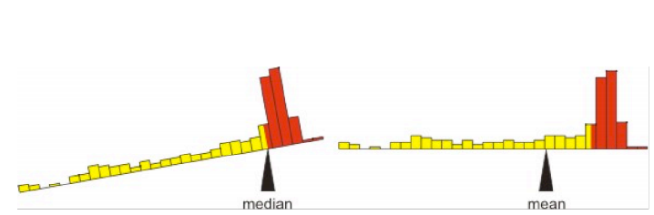

```{r setup, include=FALSE}
knitr::opts_chunk$set(echo = FALSE)
library(forcats)
library(dplyr)
library(ggplot2)
library(ggforce)
library(tidyr)
library(stringr)
library(knitr)
library(ggthemes)
library(wesanderson)
library(emo)
library(forcats)
library(ggmosaic)
library(ggridges)
library(kableExtra)
library(gridExtra)
library(ggrepel)
library(RColorBrewer)
library(plotly)
library(readr)
```


```{r}
nba <- read.csv("data/nba.csv")                     %>% 
  mutate(pos = factor(pos, levels = c("G","G/F","F","F/C","C")))

yb_theme <-   theme(axis.text.x=element_text(size=16),
        axis.text.y=element_text(size=16),
        axis.title.x = element_text(size=18),
        axis.title.y = element_text(size=18),
        legend.title = element_text(size=18),
        legend.text = element_text(size=16),
        plot.title = element_text(size=22),
        strip.text =  element_text(size=18)) 
getty        <- read.csv("https://goo.gl/iS5m1h") 

word.lengths.table <- data.frame(table(getty$word.lengths))
colnames(word.lengths.table) <- c("word.lengths", "count")
word.lengths.table$word.lengths <- as.numeric(as.character(word.lengths.table$word.lengths))  

type.of.death <- data.frame(Number = c(6688,2093,1615,745,463,222,107,73,67,52,1653),
                            Cause_of_death =c("Accidents", "Homicide", "Suicide", "Malig. tumor", "Heart disease","Congen. abnor.","Chronic res. disease", "Flu/pneumonia", "Cerebrov. disease", "Other tumor","All other cause")) %>% 
  mutate( Cause_of_death = fct_reorder(Cause_of_death,Number) ) %>%
  mutate( Cause_of_death = fct_relevel(Cause_of_death, "All other cause" ,after = 0))
```


## Cartoons


# Describing data 


##  Three common descriptions of data
<br>

<font size = 8>Location <font color = "lightgrey">(or central tendency) </font></font>
<br><br>

<font size = 8>Width <font color = "lightgrey">(or spread) </font></font>
<br><br>

<font size = 8>Association <font color = "lightgrey">(or correlation)</font></font>


## Samples and Populations

Recall, we do statistics to learn about the 
<br> <br> 
<font size = 8 color = "LIGHTSALMON">World Out There (the population)</font>


from


<font size = 8 color = "STEELBLUE"> Data (the sample)</font>

## Estimates  and Parameters

<br> <br> <br>

We almost never sample an entire population. So we can’t nail down <font size = 8 color = "LIGHTSALMON">parameters from populations</font>

<br> <br> <br>

But we can provide an educated guess of parameters by making <font size = 8 color = "STEELBLUE"> estimates from samples</font>


# Measures of location


<font color = "LAVENDERBLUSH">Mean</font>  
<font color = "LAVENDERBLUSH">Median</font>  
<font color = "LAVENDERBLUSH">Mode</font>  

## Mean, Median and Mode


<font size = 8>Mean</font> The weight of your data. <font color = "black"> The average value.</font>     
<br>    

 
<font size = 8>Median</font> A <font color = "black">typical individual.</font>... If I take an individual at random, this is the value we expect them to be closest to.   
<br>   

 
<font size = 8>Mode</font>  The <font color = "black">typical individual</font> most common value for an individual.</font>. The most likely answer for an individual selected at random.  


## Mean


<font size = 8 color = STEELBLUE> Estimate =  $\bar{Y}$</font>,   <font size = 8 color = "LIGHTSALMON">Parameter = $\mu$,</font>

 <font color = "STEELBLUE">$\Huge{\bar{Y}=\frac{(\Sigma Y_i)}{n}}$</font>

Where:

- <font color = "black">$\bar{Y}$ is the mean value</font>  

- <font color = "black">$\Sigma$</font> means sum

- <font color = "black">$n$</font> is the number of samples

- <font color = "black">$Y_i$</font> is the observed value for the  $i^{th}$ individual

## Histograms reveal measures of center   

```{r, fig.height=3.5}
ggplot(iris , aes(x = Petal.Width, fill = Species) )             +
  geom_histogram(binwidth = .2, show.legend = FALSE, alpha = .3) +  
  facet_wrap(~ Species, ncol = 3)                                + 
  scale_x_continuous(breaks = seq(.5,2.5,.5))                    +
  theme_tufte()                                                  + 
  yb_theme
```


## Mean: an example from `R`

Sum up all observations and divide by sample size. 

```{r, echo=TRUE}
iris %>% 
  group_by(Species) %>%
  summarise(mean.by.math = sum(Petal.Width) / n(),
            mean.by.r.function = mean(Petal.Width))
```

 

## Median: an example from `R`

Sort your flowers in order of petal width.     
Go halfway down, and find the middle value. 
<font size = 4, color = "lightgrey">    
The mean of the $(n+1)/2^{th}$ value for samples of odd sizes.  
The mean of the n/2 and 1+n/2 values for samples of even sizes)</font>


```{r, echo=TRUE}
iris %>% group_by(Species) %>% summarise(median = median(Petal.Width))
```

<div style= "float:right; position: relative; bottom: 20px;">

 

</div>

## Mean from a freq. table [1/2]

<font size = 6>$\frac{\sum_{cat = 1}^{n.cat}  \text{Number}_i \times \text{Value}_i}{n.total}$</font>


```{r fig.height=3, fig.width=6, message=FALSE, error=FALSE, warning=FALSE}
ggplot(data = getty, aes(x = word.lengths))                          +
  ggtitle("Return to Gettysburg Address")                           +
  geom_histogram(binwidth = 1, color = "white", fill = "lightblue") + 
  theme_tufte()                                                      + 
  scale_y_continuous(expand = c(.001,0.001))                         + 
  yb_theme                                                           +
  ylim(c(0,65))
```

## Mean from a freq. table [2/2]

Find the mean word length in Gettysburg address from a Frequency Table

```{r}
kable(t(word.lengths.table), caption = "word.lengths.table")%>%
  kable_styling()  %>%
  column_spec(1,  background = "grey",color = "white") %>%
  column_spec(seq(2, nrow(word.lengths.table), 2),  background = "WHITESMOKE") %>%
  scroll_box(width = "800px", height = "180px")
```  
<br>  


<font size = 6>$\frac{\sum_{cat = 1}^{n.cat}  \text{Number}_i \times \text{Value}_i}{n.total}$</font>


<font size = 4> numer = 1x7 + 2x50 + 3x60 + 4x58 + 5x34 + 6x24 + 7x15 + 8x6 + 9x10 + 10x4 + 11x3 = 1149.</font> 
<font size = 4>  denom = 7 +     50 +   60 +      58 +       34+   24+   15+      6+      10 +     4  +  3 = 271 .</font>   


<font color = "black">1149 / 271 = 4.24</font>


## The  proportion is the mean   

<font size = 4>coding categoricals as yes/no, and set yes = 1, no = 0)</font>

Returning to the scene of the crime,      
What prop. of deaths (age 15-19 USA 1999) where <font color = "red">homicides?</font> 

There wher 2093 Homicides of 13778 deaths. 

So   2093 / 13778 = .15 lf deaths where by homocide.   

## Mean or Median?

The mean is more convinient mathematically.    

The median is a better descriptor for skewed population.  


  


<font size = 4, color  = "black">The mean is the center of gravity </font>
<font size = 4, color  = "black">The median is the middle measurement.</font>


## Skewness

```{r, echo=FALSE, fig.height=4, fig.width=8, warning=FALSE, message=FALSE}
data.frame(vals = c(rbeta(100000,2,5), 
                    rnorm(100000,.5,.15), 
                    rbeta(100000,5,2)), 
           skew = rep(c("Right Skewed","Not skewed", "Left Skewed"),each = 100000)) %>% 
  ggplot(aes(x = vals)) + 
  geom_density(fill = "lightblue") + 
  facet_wrap(~skew) +
  scale_x_continuous(breaks = seq(.1,.9,.2), limits = c(0,1))+
  theme_tufte() +
  yb_theme
```


# Width of the data

<font color = "LAVENDERBLUSH">Range</font>  
<font color = "LAVENDERBLUSH">Interquartile Range</font>  
<font color = "LAVENDERBLUSH">Variance</font>  
<font color = "LAVENDERBLUSH">Standard deviation</font>  
<font color = "LAVENDERBLUSH">Coefficient of variation</font>  

## Measures of width

- Range   [`max value - min value`]

- Quartiles [`75th percentile - 25th percentile`]

- Variance [<font color = "STEELBLUE">  estimate = $s^2$ =$\frac{\Sigma(x_i - \bar{x})^2}{n-1}$</font>, <font color = "LIGHTSALMON">param =  $\sigma ^2$ =  $\frac{\Sigma(x_i - \bar{x})^2}{n}$ ]</font>

- Standard deviation  [<font color = "STEELBLUE">  estimate = $s$ =$\sqrt{s^2}$</font>, <font color = "LIGHTSALMON">param =  $\sigma$ =  $\sqrt{\sigma^2}$ ]</font>

- Coefficient of variation [<font color = "STEELBLUE">  estimate = CV = $\frac{s}{\bar{Y}}$</font>, <font color = "LIGHTSALMON">param =  $\frac{\sigma}{\mu}$ ]</font>

## Histograms reveal spread

```{r, fig.height=3.5}
ggplot(iris , aes(x = Petal.Width, fill = Species) )             +
  geom_histogram(binwidth = .2, show.legend = FALSE, alpha = .3) +  
  facet_wrap(~ Species, ncol = 3)                                + 
  scale_x_continuous(breaks = seq(.5,2.5,.5))                    +
  theme_tufte()                                                  + 
  yb_theme
```

## Range

The range is a poor measure of distribution width

Small samples tend to give lower estimates of the range than large samples

So, the sample range is a **biased estimator** of the true range of the population.


## Quartiles

Imagine sorting your data.

- The individual in the middle is the median

- The first and last individuals mark the range

- The other two quantiles are the individuals 1/4 and 3/4 the way into your sorted list of data.

    - The difference between these two is the **interquartile range**

## Boxplots reveals quartiles

```{r}
ggplot(data = iris, aes(x = Species, y = Sepal.Length, 
                                     fill = Species, color = Species)) + 
  ggtitle("Sepal length distributions of Iris species ")               +
  geom_boxplot(alpha = .01, show.legend = FALSE) +
  theme_tufte()                                                        + 
  yb_theme
```


##   Variance and Standard Deviation

The <font size = 8>variance</font>  measures the average squared difference between the $\mu$ and a random sample from this population.

The sample variance ($s^2$) equals the   <font color = "black">sum of squares</font>  $\Sigma(x_i - \bar{x})^2$ divided by the sample size minus one.  

The population variance ($\sigma^2$) equals the  sum of squares   divided by the sample size.


The <font size = 8>standard deviation</font> equals the square root of the variance. <font color = "lightgrey"> Use sample variance ($s^2$) for  sample sd ($s$), and population variance ($\sigma^2$) for population sd ($\sigma$). </font>  


##  Coefficient of Variation

<br> 

The <font size = 8>coefficient of variation</font> equals the standard deviation divided by the mean. 

$$\text{coef var} = \frac{\text{sd}}{\overline{x}}$$
<br> 

This allows for fair comparisons of variability between measures on different scales.     


# Effect of sample size on estimates

##  Most (good) estimators are unbiased.  

Most descriptors do not change reliably with sample size.   
Except for Range (and to a lesser extent IQR).   
Thus range is a biased estimator or width, and we don't like it   

```{r, fig.width=6, fig.height = 4.25}
my.sim <- data.frame( group = c(rep(1:20,each = 1000), 
                      rep(21:40,each = 700),
                      rep(41:60,each = 300),
                      rep(61:80,each = 100),
                      rep(81:110,each = 50), 
                      rep(111:140,each = 20), 
                      rep(141:180,each = 10), 
                      rep(181:300,each = 5))  , val = rnorm(45100,1,1)) 

my.sim.summary <- my.sim %>% 
  group_by(group) %>% 
  summarize(mean = mean(val), 
            median = median(val), 
            sd = sd(val), 
            var = var(val), 
            IQR = IQR(val), 
            range = diff(range(val)), 
            count = n()) %>% 
  gather(key = description, value = value, - group, -count) %>%
  ungroup() %>%
  mutate(description = factor(description, levels = c("mean","var","IQR","median","sd","range")))

ggplot(my.sim.summary, aes(x = count, y = value)) + 
  geom_point(alpha = .4) +
  facet_wrap(~ description, ncol = 3) + 
  scale_x_continuous(trans = "log10",breaks=round(10^seq(.5,3,.5))) +
  geom_hline(yintercept = 1, color = "grey", lty = 2)+
  theme_light() +
  xlab("sample size") +
  yb_theme
```


##  Sampling error decreases w n samples. 

Noise in estimates reliably decrease with sample size.      
Thus increased sample size increase precision.   

```{r}
my.sim.summary %>% 
  group_by(count, description) %>% 
  summarise(var2= var(value))  %>% 
  ggplot(aes(x = count, y = var2)) + 
  geom_point() + 
  facet_wrap(~description, ncol =3) + 
  scale_x_continuous(trans = "log10",breaks=round(10^seq(.5,3,.5))) + 
  scale_y_continuous(trans = "log10")+
  ylab("variance in descriptor") + xlab("sample size") +
  theme_light() +  yb_theme
```


# Review &  Nomenclature

## Describing data  

|                    | Population parameters | Sample statistics |   
|--------------------|-----------------------|----------------|
| Mean               | $\Huge{\mu}$                 | $\Huge{\bar{Y}}$         |
| Variance           | $\Huge{\sigma^2}$            | $\Huge{s^2}$             |
| Standard deviation | $\Huge{\sigma}$              | $\Huge{s}$  |                  

