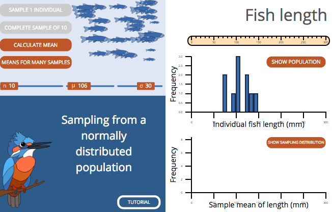
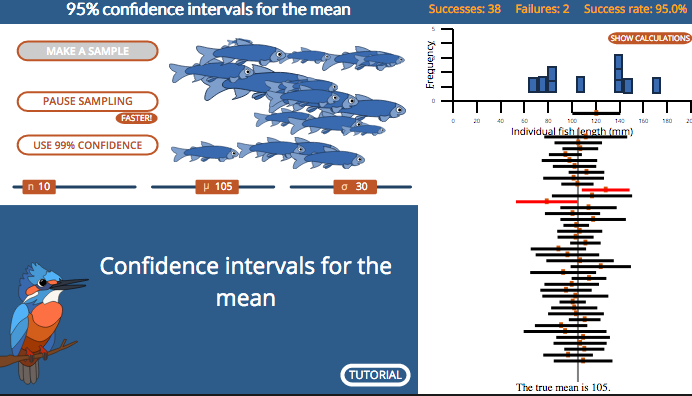

```{r setup, include=FALSE}
knitr::opts_chunk$set(echo = FALSE)
library(forcats)
library(dplyr)
library(ggplot2)
library(ggforce)
library(tidyr)
library(emoGG)
library(stringr)
library(knitr)
library(ggthemes)
library(wesanderson)
library(emo)
library(forcats)
library(ggmosaic)
library(ggridges)
library(kableExtra)
library(gridExtra)
library(ggrepel)
library(RColorBrewer)
library(plotly)
library(readr)
library(stringr)
library(infer)

yb_theme <-   theme(axis.text.x=element_text(size=16),
        axis.text.y=element_text(size=16),
        axis.title.x = element_text(size=18),
        axis.title.y = element_text(size=18),
        legend.title = element_text(size=18),
        legend.text = element_text(size=16),
        plot.title = element_text(size=22),
        strip.text =  element_text(size=18)) 
stars_theme <-    theme_tufte()+
  theme(axis.text = element_blank(),
        axis.title.x=element_blank(),
        axis.title.y=element_blank(),
        axis.ticks = element_blank())
nba <- read.csv("data/nba.csv")                     %>% 
  mutate(pos = factor(pos, levels = c("G","G/F","F","F/C","C")))
```


## Key Learning  Goals  

<font size = 6>

- Understand that since <font  color = "STEELBLUE"> estimates </font> take values by chance, they will differ from true  <font color = "lightsalmon"> population parameters. </font>       


- Connect the spread of the sampling distribution to uncertainty in  <font color = "STEELBLUE"> estimates.  </font>    

- Recognize the standard error as the standard deviation of the sampling distribution.    

- Understand the confidence interval as a plausible range of a  <font color = "lightsalmon"> parameter</font>, given an estimate and uncertainty in it.

</font>


## <font color = "steelblue">Samples</font> take their value by chance

<font size = 10>

Sets of  <font color = "STEELBLUE">samples</font> from the same distribution can be different. 

Therefore  <font color = "STEELBLUE">estimates  obtained from samples</font> from the same  <font  color = "lightsalmon">population</font> can differ by chance.

</font> 


# Sampling

## <font color = "steelblue">Sampling.</font> What's the point?  

<font size = 6>

We <font color = "STEELBLUE">sample</font> because we cannot reasonably measure the <font  color = "lightsalmon">entire population.</font>   

We cannot see the sampling distribution of hard-fought data in the real world. 

But considering the process of <font color = "steelblue">sampling</font> provides a way to quantify the uncertainty in estimates.  

</font>

## Two ways to conceptualize sampling  


Here are two correct ways* to conceptualize the process of taking a <font color = "STEELBLUE">sample</font> from a <font  color = "lightsalmon">population</font>. 


- Imagine you actually did have a population, and you randomly sampled from it, what would that look like? (e.g. measuring heights of a random collection of people taken from a full population)

- Think about the PROCESS that generates your population data, what would a sample generated by this process look like? (e.g. flipping a coin).  

<br><br>  

<font size = 4, color ="lightgrey">* but sometimes one is more convenient than the other.</font>    

# Generating samples 


## Generating samples from the population 

In three easy steps

<font size = 10, color = "black">1. Take <font color = "steelblue">samples</font> of size n. </font>    

<font size = 10, color = "black">2. Calculate parameter estimates. </font>  

<font size = 10, color = "black">3. Return to 1.</font>    

<font size = 10, color = "black">Do this A LOT</font>

<font size = 5, color = "lightgrey"> In actual analyses, we would never do this, but it's good to help make our thought concrete</font>

# Getting a feel for sampling   

<font color = "pink">Example: Sampling twenty diamonds from a known population.</font> 

## Lucky diamonds 

A  <font color = "lightsalmon">population</font> of 180 diamonds of different sizes & colors. 


```{r, fig.height=3.5, fig.width=7, warning=FALSE}
n.stars <- c(n_gold_small  =14*3,
             n_gold_medium = 8*3,
             n_gold_large  = 6*3,
             n_blue_small  = 6*3,
             n_blue_medium = 8*3,
             n_blue_large  = 3*3,
             n_red_small   = 7*3,
             n_red_medium  = 8*3,
             n_red_large   = 0*3)
stars <- tibble(color = rep( (str_extract(names(n.stars), "n_..*_") %>% 
                    str_replace_all(pattern = "n|_","")),  times= n.stars), 
                size = rep((str_replace(names(n.stars), "n_","") )  %>% 
                             str_extract( "_..*") %>% 
                             str_replace_all(pattern = "_",""),  times = n.stars)) %>%
  sample_n(size = sum(n.stars), replace = FALSE)  %>%
  mutate(x = rep(1:14, times = 14)[1:sum(n.stars)],
         y = rep(1:14, each = 14)[1:sum(n.stars)],
         size = fct_relevel(size, "small","medium","large"))

ggplot(stars, aes(x = x, y = y, color = color, size = size)) +
  geom_point(shape = 18, show.legend = FALSE) + 
  scale_color_manual(values = c("blue","gold","red")) +
  yb_theme + stars_theme
```

## A <font color = "steelblue">sample</font> of 20 diamonds 

```{r, warning=FALSE}
star.sample.size <- 20
stars.sample <- sample_n(stars, size = star.sample.size, replace = FALSE)
```


```{r, fig.height=3.5, fig.width=7, warning=FALSE}
ggplot(stars.sample, aes(x = x, y = y, color = color, size = size)) +
  geom_point(shape = 18, show.legend = FALSE) + 
  scale_color_manual(values = c("blue","gold","red")) +
#  ggtitle(sprintf("Sample of %s stars", star.sample.size))+
  yb_theme + stars_theme
```

```{r}
table(stars.sample %>% select(-x, -y)) %>%  kable() 
```


## Another  <font color = "steelblue">sample</font>  of 20 diamonds 

```{r, warning=FALSE}
stars.sample <- sample_n(stars, size = star.sample.size, replace = FALSE)
```


```{r, fig.height=3.5, fig.width=7, warning=FALSE}
ggplot(stars.sample, aes(x = x, y = y, color = color, size = size)) +
  geom_point(shape = 18, show.legend = FALSE) + 
  scale_color_manual(values = c("blue","gold","red")) +yb_theme + stars_theme
```

```{r}
table(stars.sample %>% select(-x, -y)) %>% 
  kable()
```


## And another  <font color = "steelblue">sample</font>  of 20 diamonds 

```{r, warning=FALSE}
stars.sample <- sample_n(stars, size = star.sample.size, replace = FALSE)
```


```{r, fig.height=3.5, fig.width=7, warning=FALSE}
ggplot(stars.sample, aes(x = x, y = y, color = color, size = size)) +
  geom_point(shape = 18, show.legend = FALSE) + 
  scale_color_manual(values = c("blue","gold","red")) + yb_theme + stars_theme
```

```{r}
table(stars.sample %>% select(-x, -y)) %>% 
  kable()
```


## One last  <font color = "steelblue">sample</font>  of 20 diamonds 

```{r, warning=FALSE}
stars.sample <- sample_n(stars, size = star.sample.size, replace = FALSE)
```


```{r, fig.height=3.5, fig.width=7, warning=FALSE}
ggplot(stars.sample, aes(x = x, y = y, color = color, size = size)) +
  geom_point(shape = 18, show.legend = FALSE) + 
  scale_color_manual(values = c("blue","gold","red")) + yb_theme + stars_theme
```

```{r}

table(stars.sample %>% select(-x, -y)) %>% 
  kable()
```

##  <font color = "steelblue">Sampling</font>  diamonds: Lessons learned    


1. <font color = "black"> "Sampling is random":</font> Estimates from sampling efforts varied and did not perfectly capture the true population values. 

2. <font color = "black">Random DOES NOT mean that all outcomes are equally probable.</font>    e.g.         


 - There are no <font color = "red">LARGE RED</font> diamonds in the population so we never sampled a <font color = "red">LARGE RED</font> diamond  
 
 - <font color = "gold">gold</font> is the most common diamond color in the population, so <font color = "gold">gold</font> is usually the best represented color in a sample.


## The sampling distribution 

<font size = 10>The sampling distribution  is the distribution of the  parameter estimate of interest from these samples</font>    


## The sampling distribution of diamonds

```{r}
stars <- stars %>%  select(-x, -y) 
```

```{r, echo=FALSE}
stars.sampling.dist <- stars %>% 
  rep_sample_n(size = star.sample.size, replace = FALSE, reps =  1000) %>%
  group_by(replicate, color, size) %>%
  summarise(prop = n()/ star.sample.size)

stars.sampling.dist %>% 
  ungroup()%>% 
  spread(key = size, value = prop, fill = 0)   %>% 
  group_by(replicate) %>%
  summarise(small_blue = sum(as.numeric(color == "blue") *small * 20),
            medium_blue = sum(as.numeric(color == "blue") *medium * 20),
            large_blue = sum(as.numeric(color == "blue") *large * 20),
            small_gold = sum(as.numeric(color == "gold") *small * 20),
            medium_gold = sum(as.numeric(color == "gold") *medium * 20),
            large_gold = sum(as.numeric(color == "gold") *large * 20),
            small_red = sum(as.numeric(color == "red") *small * 20),
            medium_red = sum(as.numeric(color == "red") *medium * 20),
            large_red = sum(as.numeric(color == "red") *large * 20)) %>% view()

```


```{r}
stars.sampling.dist    %>%
  spread(key = size, value = prop)  %>% 
  kable()              %>%
  kable_styling()      %>%
  row_spec(row = seq(1,1000,3),color = "blue")%>%
  row_spec(row = seq(2,1000,3),color = "gold")%>%
  row_spec(row = seq(3,1000,3),color = "red")%>%
  scroll_box(width = "700px", height = "500px") 
  
```

## Sampling distribution of diamond size

 

```{r fig.height= 5}
true.prop.large   <- sum(n.stars[grep("large",names(n.stars))]) / sum(n.stars)
sampling.dist.large <- stars.sampling.dist %>% 
  filter(size== "large") %>%   
  ungroup() %>%  
  group_by(replicate) %>%
  summarise(prop = sum(prop))

ggplot(sampling.dist.large, aes(x = prop)) + 
  geom_histogram(binwidth = 1/ star.sample.size, color = "white", fill = "black")+
  geom_vline(xintercept = true.prop.large, lty = 2, color = "white") +
  ggtitle(sprintf("Sampling distribution: Proportion large diamonds (n = %s)", star.sample.size),
          subtitle = "Dotted white line is the population parameter") +
  xlab("proportion")+
  ylab("# of replicates\n(of 1000 simulations)")+
  theme_tufte() + yb_theme 

```

## Sampling dist. of <font size = 4, color = "gold">small gold</font>  diamonds


```{r, echo=FALSE}
true_prop_gold_small  <-n.stars["n_gold_small"] / sum(n.stars)
sampling_dist_small_gold <- stars.sampling.dist %>% 
  filter(color == "gold" & size == "small")
```

```{r fig.height= 5}
ggplot(stars.sampling.dist,aes(x = prop, fill = color,lwd = size)) +     geom_histogram(binwidth = 1/star.sample.size, color = "white", show.legend = FALSE)+     scale_fill_manual(values = c("blue","gold","red"))+ xlab("proportion")+ ylab("# of replicates (of 1000 simulations)") +  ggtitle(sprintf("Joint sampling distribution: Size and color of diamonds (n = %s)", star.sample.size))+scale_y_continuous(limits = c(0,440))+scale_x_continuous(breaks = c(0,0.1,.2,.3,.4,.5))+scale_size_manual(values = c(6,3,.5))+     facet_grid(size~ color)+theme_light()+yb_theme  
```


## The joint sampling distribution  

```{r, warning = FALSE}
ggplot(stars.sampling.dist,aes(x = prop, fill = color)) + 
  geom_histogram(binwidth = 1/star.sample.size, color = "white", show.legend = FALSE)+
  scale_fill_manual(values = c("blue","gold","red")) +
  facet_grid(size~ color)
```


# How does variability in an estimate change with sample size?  

## Variability in  <font color = "steelblue">estimates</font>  `r ji("arrow_down")` with n 

```{r warning=FALSE, message = FALSE, fig.height=5.5}
stars2 <- rbind(stars %>%  rep_sample_n(size = c(5), replace =  FALSE, reps =  1000) %>% 
        ungroup()%>%
        mutate(replicate = replicate + 0,   n_reps = 5),
      stars %>%  rep_sample_n(size = c(15), replace = FALSE, reps =  1000) %>% 
        ungroup() %>% 
        mutate(replicate = replicate + 1000, n_reps= 15),
      stars %>%  rep_sample_n(size = c(30), replace = FALSE, reps =  1000) %>% 
        ungroup() %>% 
        mutate(replicate = replicate + 2000, n_reps = 30),
      stars %>%  rep_sample_n(size = c(60), replace = FALSE, reps =  1000) %>% 
        ungroup() %>% 
        mutate(replicate = replicate + 3000, n_reps = 60),
      stars %>%  rep_sample_n(size = c(120), replace = FALSE, reps =  1000) %>% 
        ungroup() %>% 
        mutate(replicate = replicate + 4000, n_reps = 120)) %>%
  group_by(replicate, color, size) %>% 
  summarize(n = n()) %>% 
  ungroup() %>% 
  group_by(replicate) %>%
  mutate(prop = n / sum(n), sample_size = sum(n)) %>%
  filter(color == "gold" & size == "small") %>%
  ungroup()


#ggplot(data  = stars2, aes(x = prop, y = factor(sample_size), group = sample_size, fill= factor(sample_size))) +
#  geom_density_ridges(scale = 1, size = 0.25, rel_min_height = 0.03,scale = 1/.000001, show.legend = FALSE) +
#  theme_tufte() + 
#  geom_vline(xintercept = true_prop_gold_small, lty = 2)  +
 # scale_y_discrete(expand = c(0,0))+
#  ggtitle("Proportion of small gold stars per sample") +
#  yb_theme + 
#  ylab("sample size")


stars2 %>% ggplot(aes(x = prop, y = prop, fill = factor(sample_size)) )+
  geom_bar(stat = "identity", show.legend = FALSE) +
  facet_wrap(~sample_size, labeller = "label_both", scales = "free_y", ncol = 2) +  
  xlab("proportion of small gold diamonds per sample")+ ylab("# samples with x proportion small gold diamonds") +
  theme_tufte()+  yb_theme  


```


## Sampling distirbution. Book's web app. 

Let's look at the web app from the book [link](http://www.zoology.ubc.ca/~whitlock/Kingfisher/SamplingNormal.htm)




# Standard Error

<font color = "pink">Example: Professional basketball players</font>

## The Standard Error

<font size = 12> The standard error of an estimate is the <font color = "black">standard deviation of its sampling distribution</font>. </font>


<font size = 12> The standard error predicts the sampling error of the estimate. </font>


## Sampling basketball players `r ji("basketball")`  

NBA players in 2014 is a fully characterized <font color ="lightsalmon">population.</font>  

```{r warning=FALSE, message = FALSE, fig.height=4.5}
nba.hist <- ggplot(data = nba, aes(x = heights)) +
  geom_histogram(color = "white", binwidth = 1) + 
  ggtitle("Histogram of NBA player heights (in inches)", )+
  theme_tufte() + yb_theme +
  annotate(geom = "text", x = 70, y =60, label =  bquote(mu==79.1), size = 6, hjust = 0)+
  annotate(geom = "text", x = 70, y =50, label =  bquote(sigma==3.43), size = 6, hjust = 0)+
 # annotate(geom = "text", x = 70, y =60, label =sprintf( "mean = %s\nsd = %s",
 #                                                        round(mean(nba$heights), digits = 2), 
 #                                                        round(sd(nba$heights), digits = 2)
 #                                                        ), size = 7, hjust = 0)+
  geom_vline(xintercept = mean(nba$heights), color = "white", lty = 2)
nba.hist
```

## Generate a <font color = "steelblue">sample</font> from the pop

```{r, echo=TRUE}
sample.heights1 <- nba %>% 
  rep_sample_n(size = 5, replace = FALSE,reps = 1)
```

A random <font color = "steelblue">sample</font> of heights of five NBA players

```{r, echo = FALSE}
x <- sample.heights1 %>% ungroup() %>% select(heights) %>% pull()
```

`r x`

The sample mean of these five players' heights

`r sample.heights1 %>% summarize(mean.height = mean(heights)) %>% select(mean.height ) %>% pull()`

## Generate many <font color = "steelblue">samples</font> from the pop

By repeating this many times

```{r, echo=FALSE}
sample.heights <- nba %>% 
  rep_sample_n(size = 5, replace = FALSE,reps = 10000) %>% 
  summarize(mean_height = mean(heights), sd_height = sd(heights))
```

```{r, echo = FALSE, warning=FALSE, message=FALSE, fig.height=4}
nba.sum <- sample.heights %>% ungroup() %>% summarise(mean = mean(mean_height), sd = mean(sd_height)) %>% unlist() %>% round(digits = 2)
nba.sum.plot <- ggplot(sample.heights, aes(x = mean_height)) +
  geom_histogram(aes(y=..count../sum(..count..)),binwidth = 1, color = "white") +
  ggtitle("Sampling distribution of NBA heights (n = 5)")+
  theme_tufte() + yb_theme +xlab(label = "mean height (in inches)")+ylab("proportion of samples")+
  annotate(geom = "text", x = 70, y =.2, label =sprintf( "mean mean = %s\n mean sd = %s",nba.sum[1], nba.sum[2]), size = 6, hjust = 0)+
  geom_vline(xintercept = mean(nba$heights), color = "white", lty = 2)+
  scale_x_continuous(limits = range(nba$heights))
nba.sum.plot 
```


<font size = 4, color = "lightgrey"> More formally, the mean of the means is "grand mean", not the mean mean.</font>

## Compare the pop & the sample dist

```{r,echo=FALSE, fig.width=8.5, fig.height=4, echo = FALSE, warning=FALSE, message=FALSE}
grid.arrange(nba.hist, nba.sum.plot,    nrow = 1)
```

<font size = 4, color = "lightgrey"> More formally, the mean of the means is "grand mean", not the mean mean.</font>

## Standard Error: Definition.

$\Huge{\sigma_{\bar{X}}= \frac{\sigma_X}{\sqrt{n}}}$


<font size = 10>The standard error of an estimate is the standard deviation of its sampling distribution.</font>


## Standard Error of the Mean [1/2]

Is the standard deviation of this ditribution `r ji("point_down")`.  

```{r, echo = FALSE, warning=FALSE, message=FALSE, fig.height=4}
nba.sum <- sample.heights %>% ungroup() %>% summarise(mean = mean(mean_height), sd = sd(sd_height)) %>% unlist() %>% round(digits = 2)
nba.sum.plot <- ggplot(sample.heights, aes(x = mean_height)) +
  geom_histogram(binwidth = 1, color = "white") +
  ggtitle("Sampling dist NBA heights", subtitle = "Sample size of 5")+
  theme_tufte() + yb_theme +
  annotate(geom = "text", x = 70, y =2100, label =sprintf( "mean mean = %s\n mean sd = %s",nba.sum[1], nba.sum[2]), size = 4, hjust = 0)+
  geom_vline(xintercept = mean(nba$heights), color = "white", lty = 2)+
  scale_x_continuous(limits = range(nba$heights))
nba.sum.plot 
```


## Standard Error of the Mean  [2/2]

```{r, echo=TRUE}
# REMEMBER: The standard dev. of our sampling distribution (n = 5)
sampling.dist <- sample.heights$mean_height
sd(sampling.dist)  
```

This value closely matches the equation for the standard error of a sample of size 5 from a population with $\sigma = 3.43$.

$\Large{\sigma_{\bar{X}}= \frac{\sigma_X}{\sqrt{n}}}  = \Large{\sigma_{\bar{X}}= \frac{`r round(sd(nba$heights), digits = 2)`}{\sqrt{5}}} = `r round(sd(nba$heights) / sqrt(5),digits = 2)`$
 


## Standard Error: Key Math & Concepts  
 

<font size = 10, color = "lightsalmon"> Because we rarely know the population sd $(\sigma)$,  we cannot find the parameter  $\sigma_{\bar{X}}= \sigma_X / \sqrt{n}$  </font>. 

<font size = 10, color = "steelblue"> But, we can use the sample standard deviation ($s$) to estimate the standard error   $SE_{\bar{X}}= s / \sqrt{n}$</font>


## Estimating the Standard Error 


$\large{SE_{\bar{X}}}$ is a parameter with its own sampling distribution!!   
It's an estimate of $\sigma_{\bar{X}}$


```{r}
ggplot(data = sample.heights, aes(x = sd_height / sqrt(5))) +
  geom_histogram(bins = 20, color = "white")                + 
  theme_tufte()                                             +
  geom_vline(xintercept = sd(nba$heights) / sqrt(5),  
             col = "white", lty = 2)                        +
  ggtitle("Sampling distribution of the standard error", subtitle = "From nba height data. dotted line is the TRUTH") +
  xlab("Estimate of the standard error of the mean (n = 5)")+
  yb_theme
```


# Effect of Sample Size on the Standard Error

## SE Decreases with Sample Size

<font size = 20, color = "coral"> The standard error goes down as a sample size goes up </font>


## Large Uncertainty w Small Samples 1/3

<font size =10> Uncertainty increases as sample size decreases.  

Therefore, extreme values are often associated with small sample size.   
</font> 

<br><br>

Example: baseball pitchers performance (reported as ERA).  


## Large Uncertainty w Small Samples 2/3

Pitchers with the lowest era's tended to face the fewest batters. 

```{r, message=FALSE, warning=FALSE}
pitch <- read_csv("data/Pitching.csv") %>% filter(yearID == 2018 & ERA!=0) %>% 
  mutate(best_ten = rank(ERA)<=10, worst_ten = rank(-ERA)<=10) 
 ggplot(pitch,aes(x = BFP, y = ERA, color = best_ten )) +geom_point(show.legend = FALSE)+
  scale_y_continuous(trans = "log10", limits  = c(.35,8))+
   xlab("Batters faced")+
   scale_color_manual(values = c("grey","red"))+
   ggtitle("Lowest ERAs in baseball in 2018 (in red)") +
   theme_tufte() +
   yb_theme
```


## Large Uncertainty w Small Samples 3/3

Pitchers with the higheset ERA's  faced the fewest batters. 

```{r, message=FALSE, warning=FALSE}
 ggplot(pitch,aes(x = BFP, y = ERA, color = worst_ten )) +geom_point(show.legend = FALSE)+
  scale_y_continuous(trans = "log10")+
   xlab("Batters faced")+
   scale_color_manual(values = c("grey","blue"))+
   ggtitle("Highest ERAs in baseball in 2018 (in blue)") +
   theme_tufte() +
   yb_theme
```

## Lesson Large Uncertainty w Small n

Treat simple summary statistics with skepticism. 

Be sure to consider uncertainty in your estimate, before getting carried away by exceptional values.


# Confidence interval 

<font size = 10, color = "coral"> A plausible range for a parameter.</font> 


## Confidence Interval (CI's)

Values for the parameter lying within the interval are plausible, given the data and our agreed upon confidence. 

Values for the parameter lying within the interval are less plausible, given the data and our agreed upon confidence. 

## The 2SE rule-of-thumb

A rough estimate of the 95\% CI for the mean is:

$$\bar{X} - 2 SE_{\bar{X}}  \text{ to } \bar{X} + 2 SE_{\bar{X}}$$ 

<br><br><br><br><br><br><br><br><br><br><font size = 4, color = "lightgrey"> (Assuming normally distributed population and/or sufficiently large sample size.)</font>


```{r, echo=FALSE, message=FALSE, warning=FALSE}
MakeSampleMeansGraph <- function(samples, actual.mean,x_lim = NA,...){
  if(is.na(x_lim)){x_lim <-range(c(samples))}
  sample.means <- colMeans(samples)
  sample.SEs   <- apply(samples,2,sd)/sqrt(nrow(samples))
	plot(1,xlim = x_lim , ylim = c(0,(1+ncol(samples))),
		type="n",axes = FALSE, ylab = "",...)
	segments(x0 = (sample.means - 2 * sample.SEs) , 
           y0 = seq_along(samples[1,]), 
           x1 = (sample.means + 2 * sample.SEs),  
           y1 =  seq_along(samples[1,]), 
           col="blue" )
	abline(v=actual.mean, col = "red")
	box()
	axis(1)
	mtext("sample", side =2 ,line = .5)
}
```

## Visualizing 95\% CIs

```{r, echo=FALSE, message=FALSE, warning=FALSE}
par(mfrow = c(1,2), mar = c(5,2,3,1))
sample.5 <- replicate(100,sample(nba$heights,5))
sample.20 <- replicate(100,sample(nba$heights,20))
MakeSampleMeansGraph(sample.5, mean(nba$heights), main = "95% CI Estimated mean NBA height (n = 5)",xlab = "heights (inches)")
MakeSampleMeansGraph(sample.20, mean(nba$heights), main = "95% CI Estimated mean NBA height (n = 20)",xlab = "heights (inches)")
```


## How to properly intepret CIs 

<font color = "red"> Not correct </font> `r ji(keyword = "-1")`   


  - "There is a 95% probability that the population mean is within a particular 95% confidence interval"


<font color = "blue"> Correct </font> `r ji(keyword = "+1")`  

  - "95% of all 95% confidence intervals calculated from samples include the population mean."
  


<font color = "blue">  OR </font>  `r ji(keyword = "+1")`  

  - "We are 95% confident that the population mean lies within the 95% confidence interval."


## Example: Human Gene Lengths.

```{r,echo=FALSE, message=FALSE, warning=FALSE}
gene.lengths <- read.csv("http://whitlockschluter.zoology.ubc.ca/wp-content/data/chapter04/chap04e1HumanGeneLengths.csv")

geneLengths.dist <- rbind(gene.lengths %>%  rep_sample_n(size = c(20), replace =  FALSE, reps =  1000) %>% 
        ungroup() %>%
        mutate(replicate = replicate + 0,   n_reps = 20),
        gene.lengths %>%  rep_sample_n(size = c(100), replace = FALSE, reps =  1000) %>% 
        ungroup() %>% 
        mutate(replicate = replicate + 1000, n_reps= 100),
        gene.lengths %>%  rep_sample_n(size = c(500), replace = FALSE, reps =  1000) %>% 
        ungroup() %>% 
        mutate(replicate = replicate + 1000, n_reps = 500)) %>%
  group_by(replicate,  n_reps) %>% 
  summarize(mean_length = mean(geneLength), sample_size = n()) %>%
  ungroup() 

ggplot(data  = geneLengths.dist, aes(x = mean_length)) +
  geom_histogram(bins = 40,fill = "firebrick", color="white") +
  geom_vline(xintercept = mean(gene.lengths[,1], na.rm = TRUE), lty = 2, color = "gold")  +
  scale_y_discrete(expand = c(0,0))+
  facet_wrap(~sample_size,ncol = 1)+
  ggtitle("Sampling dist of human gene lengths") +
  yb_theme 

```


## 95% CI for Mean Human Gene Length

```{r, echo=FALSE, fig.height=5, message=FALSE, warning=FALSE}
par(mfrow = c(2,1),mar = c(3,2,2,2))
MakeSampleMeansGraph(replicate(10,sample(gene.lengths[,1],10)),mean(gene.lengths[,1]), x_lim  = c(0,10000),  xlab = "gene length (bp)",main="mean lengths of samples of 10 human genes [10 replicate gene sets]")

MakeSampleMeansGraph(samples = replicate(10,sample(gene.lengths[,1],100)),actual.mean = mean(gene.lengths[,1]),x_lim   = c(0,10000), xlab = "gene length (bp)", main="mean lengths of samples of 100 human genes [10 replicate gene sets]")
```


## Confidnce Intervals. Book's web app. 

Let's look at the web app from the book [link](http://www.zoology.ubc.ca/~whitlock/Kingfisher/CIMean.htm)



# Pseudoreplication

## What is Pseudoreplication?


Pseudoreplication is the error that occurs when samples are not independent, but they are treated as though they are. 

i.e. Your sample size is smaller than you thought. 

Pseudoreplication provides a false sense of high certainty. 

</font>  

## Example: Pseudoreplication

You are interested in average pulse rate of mountain climbers. 

Since they are hard to find, you decide to take 10 measurements from each climber. 

You study 6 climbers, so you have 60 measurements.

What is your sample size (n)? 

## Avoiding pseudoreplication

You are interested in average pulse rate of mountain climbers. 

Since they are hard to find, you decide to take 10 measurements from each climber. 

You study 6 climbers, so you have 60 measurements.

Take the mean blood pressure for each climber, so that you have 6 pulse rates, one for each climber (n = 6).

