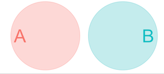
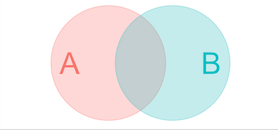

```{r setup, include=FALSE}
knitr::opts_chunk$set(echo = FALSE)
library(forcats)
library(dplyr)
library(ggplot2)
library(ggforce)
library(tidyr)
library(stringr)
library(knitr)
library(ggthemes)
library(wesanderson)
library(emo)
library(forcats)
library(ggmosaic)
library(ggridges)
library(kableExtra)
library(gridExtra)
library(ggrepel)
library(RColorBrewer)
library(plotly)
library(readr)
library(stringr)
library(infer)
library(emoGG)

yb_theme <-   theme(axis.text.x=element_text(size=16),
        axis.text.y=element_text(size=16),
        axis.title.x = element_text(size=18),
        axis.title.y = element_text(size=18),
        legend.title = element_text(size=18),
        legend.text = element_text(size=16),
        plot.title = element_text(size=22),
        strip.text =  element_text(size=18)) 
stars_theme <-    theme_tufte()+
  theme(axis.text = element_blank(),
        axis.title.x=element_blank(),
        axis.title.y=element_blank(),
        axis.ticks = element_blank())
nba <- read.csv("data/nba.csv")                     %>% 
  mutate(pos = factor(pos, levels = c("G","G/F","F","F/C","C")))
```


## Key Learning  Goals  

<font size = 6>

- Understand  why probability theory is the foundation for statistical reasoning.     

- Think addition upon hearing the word "OR"

- Think multiplication upon hearing the word "AND"

- Calculate probabilities of complex events by using standard rules of probability theory. 

- Use Bayes' theorem to translate between probabilistic statements.

</font>


# Review

## Samples and populations

<font size = 8> We do statistics to learn about the   

<font color = "LIGHTSALMON">World Out There (the population)</font>  


from


<font color = "STEELBLUE"> Data (the sample)</font> </font>

## Why Sample? 


<font size = 8> We almost never sample an entire population. So we can’t nail down <font color = "LIGHTSALMON">parameters from populations</font>


But we can make an educated guess of parameters by making <font color = "STEELBLUE"> estimates from samples</font>

</font>


# <font size = 8 color = "LIGHTSALMON">Probability  Theory</font>

## <font size = 8 color = "LIGHTSALMON">Probability </font>

The <font size = 10, color = "LIGHTSALMON">probability</font>   of an event is its <font size = 10, color = "LIGHTSALMON">true relative frequency.</font>   

This is the proportion of times the event would occur if we repeated the same process over and over again.

## Probability allows us to connect


<font size = 8, color = "steelblue"> Sample estimates:</font>   

- Which we can obtain from data.  

- Which take their values by chance.      

<font size = 8,  color = "lightsalmon">     To Population Parameters: </font>     

- Which we can almost never obtain.     

- With values free from chance.

<br> <br>     

<font size = 5, color = "red"> Probability theory shapes how we apply and interpret statistics. </font>


## Foundational Concepts in Probability   

<font color = "black">Sample space</font>  The world of potential outcomes    

<font color = "black">Mutually exclusive events - </font>  If A & B are mutually exclusive 

<div style= "float:right; position: relative; bottom;">

</div>

- A $OR$ B are plausible outcomes  


- A $AND$ B is not  <font color = "lightgrey"> (i.e.  $P[A \& B] = 0$) </font>  

<font color = "black">Not mutually exclusive events - </font>   If A & B are not mutually exclusive if  

<div style= "float:right; position: relative; bottom;">

</div>

- There's a chance of outcome A $AND$ B   

- P[A & B] $\neq$ 0


 
 
 
# Probability Distribution

<font size = 9, color = "coral">A probability distribution describes the true relative frequency of all possible values of a random variable.</font> 


## The Sampling Distribution 

<font size = 10, color = "black">The sampling distribution</font>   

<font size = 10, color = "purple"> The probability distribution  of estimates from a sample of size n from a known population is among the most important probability distributions for statistics. </font>  

## Probability: Distributions  vs  Densities 

<div style= "float:right; position: relative; bottom;">

```{r, fig.height=2, fig.width=3}
ggplot(tibble(x=rnorm(1000000)), aes(x = x)) + geom_histogram(color = "white",fill = "ivory4", bins = 30, alpha = .4) + ggtitle("Probability distribution")+
    theme(plot.title = element_text(hjust = 0.5, size = 20)) + ylab("")+
    xlab("")+ theme_tufte()+yb_theme+theme(axis.text.x = element_blank(),axis.text.y = element_blank(), axis.ticks = element_blank()) +annotate(x = 3.5, y = 1e5,geom = "text", label = bquote(Sigma~p[x]==1), size = 7)
```

</div>

Technically, only <font color = "forestgreen">discrete variables have probability distributions,</font> as all discrete values have a finite probability. 

<br><br><br><br>

<div style= "float:right; position: relative; bottom;">

```{r, fig.height=2, fig.width=3}
ggplot(tibble(x=rnorm(1000000)), aes(x = x)) + geom_density(fill = "forestgreen", color = "white",alpha = .4) + ggtitle("Probability density")+
    theme(plot.title = element_text(hjust = 0.5, size = 20)) + ylab("")+
    xlab("")+ theme_tufte()+yb_theme+theme(axis.text.x = element_blank(),axis.text.y = element_blank(), axis.ticks = element_blank()) +annotate(x = 3.5, y = .3,geom = "text", label = bquote(integral(p[x])==1), size = 7)
```

</div>

The probability of any value from a continuous distribution is infinitesimally small.  Therefore, <font color = "forestgreen">continuous variables have probability densities,</font> not probability distributions. 
  


## <font color = "LIGHTSALMON">Probability</font> distribution: A die `r ji("dice")`   

```{r, echo=FALSE}
plot.one.dice.prob  <- data.frame(outcome = c(1:6), probability = 1/6) %>%
  ggplot(aes(x = outcome, y = probability, fill = factor(outcome))) +
  geom_bar(stat  = "identity", show.legend = FALSE) +
  ggtitle("Outcome of a fair die")+
  scale_x_continuous(breaks = 1:6)+
  scale_y_continuous(expand = c(0,0), limits  = c(0,.35))+
  ylab("Expected probability")+
  theme_tufte() +
  yb_theme +
  theme(axis.ticks = element_blank())
plot.one.dice.prob
```


## <font color = "LIGHTSALMON">Probability</font> dist:  Sum of 2 dice `r ji("dice")` + `r ji("dice")`     

```{r,  echo=FALSE}
plot.two.dice.prob <- data.frame(outcome =  c(sapply(1:6,function(X){X+1:6}))) %>% 
  ggplot(aes(x = outcome, fill = factor(outcome)))+
  geom_bar(aes(y = (..count..)/sum(..count..)), show.legend = FALSE)+
  ggtitle("Outcome of the sum of two fair dice")+
  scale_x_continuous(breaks = 1:12)+
  scale_y_continuous(expand = c(0,0), limits  = c(0,.35))+
  ylab("Expected probability")+
  theme_tufte() +
  yb_theme +
  theme(axis.ticks = element_blank())
plot.two.dice.prob
```


# <font color = "STEELBLUE">Proportion</font>

<font color = "coral">The number of times an event occurs divided by the number of tries</font>

## <font color = "STEELBLUE">The Proportion</font>  

The proportion is the number of times an event occurs divided by the number of tries.

We can think of a <font size = 12 color = "STEELBLUE">proportion</font> as a realized sample from our <font size = 12 color = "LIGHTSALMON">probability</font> distribution. 


```{r echo = FALSE}
dice <- tibble(first_roll = sample(x = 1:6, size = 50, replace = TRUE))#                                          ; kable(dice) %>%  #kable_styling()      %>% scroll_box(width = "700px", height = "300px")
```

##  <font color = "STEELBLUE">Proportion</font>: Outcome of a die  `r ji("dice")` 

```{r, echo=FALSE}
plot.one.dice.prop<- ggplot(data = dice, aes(x = first_roll, fill = factor(first_roll)))+
  geom_bar(aes(y = (..count..)/sum(..count..)), show.legend = FALSE)+
  ggtitle("Outcome of a fair die (of 50 rolls)")+
  scale_x_continuous(breaks = 1:12)+
  ylab(label = "Observed proportion")  +
  xlab(bquote(1^{st}~roll))+
  scale_y_continuous(expand = c(0,0), limits  = c(0,.35))+
  theme_tufte() +
  yb_theme +
  theme(axis.ticks = element_blank())
```

```{r}
grid.arrange(plot.one.dice.prob+ggtitle("Probability")+  xlab(bquote(1^{st}~roll)), plot.one.dice.prop+ggtitle("Proportion (of 50)"), ncol =2)
```

## <font color = "STEELBLUE">Proportion:</font> Sum of 2 dice `r ji("dice")` + `r ji("dice")`


```{r echo = FALSE}
dice <-  dice %>% 
  mutate(second_roll = sample(x = 1:6, size = n(), replace = TRUE),
         sum_of_rolls = first_roll + second_roll )                                                                        ; #kable(dice) %>%  kable_styling()      %>% scroll_box(width = "700px", height = "300px")
```


```{r, echo=FALSE}
plot.two.dice.prop <- ggplot(data = dice %>% head(n =50), aes(x = sum_of_rolls, fill = factor(sum_of_rolls)))+
  geom_bar(aes(y = (..count..)/sum(..count..)), show.legend = FALSE)+
  ggtitle("Outcome: Sums of a pair of fair dice (of 50 rolls)")+
  scale_x_continuous(breaks = 1:12)+
  ylab(label = "Observed proportion")  +
  xlab(bquote(1^{st}~+~2^{nd}~roll))+
  scale_y_continuous(expand = c(0,0), limits  = c(0,.35))+
  theme_tufte() +
  yb_theme +
  theme(axis.ticks = element_blank())
plot.two.dice.prop
```

## Compare <font color = "LIGHTSALMON">probs</font> & <font color = "STEELBLUE">proportions</font> `r ji("dice")` + `r ji("dice")` 

```{r}
grid.arrange(plot.two.dice.prob + ggtitle("Probability")+xlab(bquote(1^{st}~+~2^{nd}~roll)), plot.two.dice.prop + ggtitle("Proportion (of 50)") ,    nrow = 1)
```


# Probability Rules: 


# The addition principle 

<font color = "coral">[This OR That](https://www.youtube.com/watch?v=K9F5xcpjDMU)</font>


## General Addition Principle


$\large{P[A \text{ OR } B] = P[A] + P[B] - P[A \text{ AND } B]}$  

<br><br>    
 
<font size = 8> 
The probability of <font color = "black">A or B</font> equals  
The probability of <font color = "black">A</font>  
<font color = "blue">PLUS</font> the probability of <font color = "black">B</font>  
<font color = "red">MINUS</font> the probability of <font color = "black">A and B</font>  
</font>

## Special case of the addition principle 

<font size = 10, color = "black">Mutually exlusive events</font  >  

<font size = 10>If A and B are mutually exclusive</font>     

<br>  

$\large{P[A \text{ AND } B] = 0}$, so ...   

<br>


$\Large{ Pr[A \text{ OR } B] = Pr[A] + Pr[B]}$


## Example: Probability of a Range [1/2]

<font color = "darkred">The probability the sum of two dice is between six and eight.</font>   

$\large{P[ 6\leq }$`r ji("dice")` + `r ji("dice")`  $\large{ \leq 8] = P[6] + P[7] + P[8]}$


```{r, fig.height=4}
data.frame(outcome =  c(2, 3, 4, 5, 6, 7, 8, 9, 10, 11, 12),
           prob    =  c(1, 2, 3, 4, 5, 6, 5, 4, 3, 2, 1) / 36)%>% 
  mutate(my.col = outcome>5 & outcome < 9) %>%
  ggplot(aes(x = outcome, y = prob, fill = my.col))+
  geom_bar(stat = "identity",show.legend = FALSE)+
  ggtitle("Outcome of the sum of two fair dice")+
  scale_x_continuous(breaks = 1:12)+
  scale_y_continuous(expand = c(0,0), limits  = c(0,.35))+
  xlab(bquote(1^{st}~+~2^{nd}~roll))+
  ylab("Expected probability")+
  scale_fill_manual(values = c("lightgrey","lightblue"))+
  theme_tufte() +
  yb_theme +
  theme(axis.ticks = element_blank())
```


## Example: Probability of a Range  [2/2]

<font color = "darkred">The probability the sum of two dice is between six and eight.</font>   

$\large{P[ 6\leq }$`r ji("dice")` + `r ji("dice")`  $\large{ \leq 8] = P[6] + P[7] + P[8]}$


```{r, fig.height=4}
data.frame(outcome =  factor(c(2, 3, 4, 5, "6:8", 9, 10, 11, 12),
                             levels = c(2, 3, 4, 5, "6:8", 9, 10, 11, 12)),
           prob    =  c(1, 2, 3, 4, 5 + 6+ 5, 4, 3, 2, 1) / 36)%>% 
  mutate(my.col = (outcome == "6:8")) %>%
  ggplot(aes(x = outcome, y = prob, fill = my.col))+
  geom_bar(stat = "identity",show.legend = FALSE)+
  ggtitle("Outcome of the sum of two fair dice")+
  scale_y_continuous(expand = c(0,0), limits  = c(0,.5))+ 
  theme_tufte() +
  yb_theme +
  ylab("Expected probability")+
  scale_fill_manual(values = c("lightgrey","lightblue"))+
  xlab(bquote(1^{st}~+~2^{nd}~roll))+
  theme(axis.ticks = element_blank()) 


```


## Example: Probability of Not

<font color = "darkred">The probability the sum of two dice is not between six and eight.</font>   

Because  $1 = \Sigma$ (all posibilities), ...  $P[\text{not x}] = 1 - P[x]$  

```{r, fig.height=3.5, fig.width=5}
data.frame(outcome =  factor(c("Not between 6 & 8", "Between  6 & 8"),
                             levels = c("Not between 6 & 8", "Between  6 & 8")),
           prob    =  c((1+2+3+4+4+3+2+1) , (5 +6+5) ) / 36)%>% 
  mutate(my.col = (outcome == "6:8")) %>%
  ggplot(aes(x = outcome, y = prob, fill = outcome))+
  geom_bar(stat = "identity",show.legend = FALSE)+
  ggtitle("Outcome of the sum of two fair dice")+
  ylab("Expected probability")+
  scale_fill_manual(values = c("lightgrey","lightblue"))+
  scale_y_continuous(expand = c(0,0), limits  = c(0,.7))+ 
  theme_tufte() +
  yb_theme +
  xlab(bquote(1^{st}~+~2^{nd}~roll))+
  theme(axis.ticks = element_blank()) 
```


## Example: General Addition Principle

<font color = "darkred">Probability that the sum of two dice is  <font color ="red">odd or between 6 & 8</font>.</font>  

Subtract P[A & B] to avoid double counting nonexclusive events


$\large{P[A \text{ OR } B] = P[A] + P[B] - P[A \text{ AND } B]}$   

$P[\text{Odd OR  Between 6 & 8}]$ $= P[\text{Odd}] + P[\text{Between 6 & 8}] - P[\text{Odd AND Between 6 & 8}]$   


```{r, fig.height=2.25}
two.die.revisited <- data.frame(
  outcome =  c(2, 3, 4, 5, 6, 7, 8, 9, 10, 11, 12),
  prob    =  c(1, 2, 3, 4, 5, 6, 5, 4, 3, 2, 1) / 36) %>%
  mutate(sixeight = outcome >5 & outcome <9,
         odd      = outcome %%2 ==1,
         oddandsixeight = sixeight &  odd, 
         oddorsixeight =  sixeight|odd)

dice.theme <- ggplot(two.die.revisited, aes(x = outcome, y = prob))+
 # ylab(label = "probs")+
  ylab("")+
  scale_y_continuous(expand = c(0,0), limits  = c(0,.2))+ 
  scale_x_continuous(breaks = 1:12)+
  theme_tufte() +
  xlab(bquote(1^{st}~+~2^{nd}~roll))+
  yb_theme +
  theme(axis.ticks = element_blank(), 
        axis.text.y  = element_blank(), 
        axis.text.x = element_text(size = 8)) 


sixthrougheight <- dice.theme +  
  geom_bar(aes(fill = sixeight),stat = "identity",show.legend = FALSE) + 
  scale_fill_manual(values = c("lightgrey","lightblue")) 
odd             <- dice.theme +  
  geom_bar(aes(fill = odd),stat = "identity",show.legend = FALSE) +
  scale_fill_manual(values = c("lightgrey","lightblue"))+ 
  ylab("PLUS")
seven           <- dice.theme +  
  geom_bar(aes(fill = oddandsixeight),stat = "identity",show.legend = FALSE) +
  scale_fill_manual(values = c("lightgrey","red"))+ 
  ylab("MINUS")
tots    <- dice.theme +  geom_bar(aes(fill = oddorsixeight),stat = "identity",show.legend = FALSE) + scale_fill_manual(values = c("lightgrey","lightblue"))+ 
  ylab("EQUALS")  

grid.arrange(sixthrougheight, odd, seven, tots ,    nrow = 1)
```

 
## Challenge:  General Addition Principle 

Use the general addition principle to find the proportion of animals that walk or fly. 

```{r, fig.height=4, fig.width=4.5}
data.frame(walk = c("walks","can't walk","walks","can't walk"), 
           fly = c("flies","flies","doesn't fly","doesn't fly"), 
           prop = c(3/24,1/24,1/3,1/3), 
           emo = c('1f426', '1f987','1f418' ,'1f40d')) %>%
  ggplot( ) +
  geom_mosaic(aes(x = product(fly), weight = prop,
                            fill = walk), alpha = .2, show.legend = FALSE) + 
  theme_tufte()+ 
  ylab("Walks?") +
  xlab("Flies") +
  scale_fill_manual(values = c("lightblue", "orange")) +
  geom_emoji(emoji = '1f426', aes(x=.9, y=.8), size=.1) +
  geom_emoji(emoji = '1f418', aes(x=.4, y=.8), size=.1) +
  geom_emoji(emoji = '1f40d', aes(x=.4, y=.1), size=.1) +
  geom_emoji(emoji = '1f987', aes(x=.9, y=.1), size=.1) +
  ggtitle("General addition principle")+
  theme_tufte()+
  yb_theme +
  theme(axis.text.y = element_text(angle = 90, hjust = c(.5,0),vjust = -1),
        axis.ticks = element_blank()) 
```


<font  size = 4, color = "lightgrey"> See exceptions: [walking bat](http://66.media.tumblr.com/tumblr_m1x0ugUQTu1qk3okno1_500.gif), [flying elephant](https://66.media.tumblr.com/e6b56bb701d4c7ad09d4ce964b22232a/tumblr_npqq07w9XB1rwfctbo1_500.gif) </font>


 
## Answer:  General Addition Principle 

Use the general addition principle to find the proportion of animals that walk or fly. 

<div style= "float:left; position: relative; bottom;">

```{r, fig.height=4, fig.width=4.5}
data.frame(walk = c("walks","can't walk","walks","can't walk"), 
           fly = c("flies","flies","doesn't fly","doesn't fly"), 
           prop = c(3/24,1/24,1/3,1/3), 
           emo = c('1f426', '1f987','1f418' ,'1f40d')) %>%
  ggplot( ) +
  geom_mosaic(aes(x = product(fly), weight = prop,
                            fill = walk), alpha = .2, show.legend = FALSE) + 
  theme_tufte()+ 
  ylab("Walks?") +
  xlab("Flies") +
  scale_fill_manual(values = c("lightblue", "orange")) +
  geom_emoji(emoji = '1f426', aes(x=.9, y=.8), size=.1) +
  geom_emoji(emoji = '1f418', aes(x=.4, y=.8), size=.1) +
  geom_emoji(emoji = '1f40d', aes(x=.4, y=.1), size=.1) +
  geom_emoji(emoji = '1f987', aes(x=.9, y=.1), size=.1) +
  ggtitle("General addition principle")+
  theme_tufte()+
  yb_theme +
  theme(axis.text.y = element_text(angle = 90, hjust = c(.5,0),vjust = -1),
        axis.ticks = element_blank()) 
```

</div> 


Answer: 

Walks (`r 	ji("elephant")` + `r 	ji("bird")`)   
<font color = "blue"> + </font> Flies (`r 	ji("bat")` + `r 	ji("bird")`)  
<font color = "red"> - </font>  Walks and flies `r 	ji("bird")`     

= `r 	ji("elephant")` + 2 `r 	ji("bird")`   + `r 	ji("bat")` - `r 	ji("bird")`    
= `r 	ji("elephant")` +  `r 	ji("bird")`   + `r 	ji("bat")` 


# General Multiplication Principle 

<font color = "coral">This AND that</font>

## The general multiplication principle 

The probability of A and B, equals the probability of one event times the probability of the second, conditioned on the first. 

$\Large{P[A \text{ & } B] = P[A] \times P[B|A]}$  


## Independence 

<font size = 6, color = "black">Two events are independent if the occurrence of one gives no information about whether the second will occur. </font>  

i.e. A & B are independent if   $P[B|A] = P[B]$

<br><br><br><br><br><br>     

<font size = 4, color = "red"> Note (in)dependence does not imply any mechanistic or causative relationship.  </font> 
 


## Probabilities for Independent Variables  

The Multiplication Principle <font color = "lightgrey"> (a special case of the general multiplication principle)


Remember the general multiplication principle: $P[A \text{ & } B] = P[A] \times P[B|A]$

If A & B are independent $P[B|A] = P[B]$   </font>    

Therefore, if A & B are independent: $P[A \text{ & } B]$ = $\Large{P[A \text{ & } B] = P[A] \times P[B]}$    

That is, if A & B are independent, the probability of A and B is the probability of A times the probability of B.  


  

## Mutually exclusive events

Are they independent, ?

## Example: Oguchi disease


*"Oguchi disease, also called congenital stationary night blindness, Oguchi type 1 or Oguchi disease 1, is an <font color = "black">autosomal recessive</font> form of congenital stationary night blindness associated with fundus discoloration and abnormally slow dark adaptation."* 

- from http://en.wikipedia.org/wiki/Oguchi_disease 

<br><br>  <br><br>  <br><br>   

<font size= 5>Since Oguchi disease is <font color = "black">autosomal recessive</font>, it is only expressed if an individual inherits both the mutant allele from mom and from dad. </font>  

## Child of two Oguchi carriers  

<font color = "darkred"> If both of parents have an affected chromosome but no disease, what's the probability that a given child will have Oguchi disease?</font>   

Remember: A child gets Oguchi disease by inheriting <font color = "black">two affected</font> chromosomes.   
  
A child has a $\frac{1}{2}$ chance of inheriting mom's affected chromosome <font size = 6, color = "black">AND</font> a $\frac{1}{2}$ chance of inheriting dad's affected chromosome.  

So, the probability that a given child of heterozygotes has the disease = $\frac{1}{2} \times \frac{1}{2} = \frac{1}{4}$.


## Children of two Oguchi carriers:


<font color = "darkred"> If both of parents have an affected chromosome but no disease, what's the probability that both of their childred will have Oguchi disease?</font>     


$Pr[\text{(child 1 & child 2 have disease)}] = 1/4  \times 1/4 = 1/16$


```{r, fig.height = 4.5, fig.width= 6, fig.align='center', eval= TRUE, echo = FALSE, warning=FALSE}
punnet <- cbind(no.disease= c(no.disease = 3/4, yes.disease = 1/4),
                yes.disease=c(3/4 *1/4,1/4*1/4))

par(mar = c(6,2,2,0))
mosaicplot(punnet,col= c("orange","lightblue","puple","green"), main = "", cex.axis = -1, text.color = "white",xlab = "Child 1", ylab=
             "Child 2")
text(x = 1.5/4, y = 2.2/4,labels = "Neither has Oguchi",cex = 1.1)
text(x = 1.5/4, y = 1/14,labels = "Child 1 has Oguchi",cex = 1.1)
text(x = 3.4/4, y = 2.2/4,labels = "Child 2 \nhas Oguchi",cex = 1.1)
text(x = 3.4/4, y = 1/14,labels = "Both \nhave Oguchi",cex = 1.1)

```


# Working through probability logic with probability trees

## Probability Trees

Probability theory can be hard, logic is straightforward.  

Being explicit about what you're doing makes this easier.

Probability trees offer a simple way to follow your accounting.


## Probability trees: Oguchi  

```{r,echo=FALSE}
  par(mar = c(1,2,3,8))
  plot(0,type="n",axes=F,xlab="",ylab="",xlim=c(0,1),ylim=c(0,1), main = "Transmission of Oguchi disease")
  arrows( x0 = c(.1,.1) , y0 = c(.52,.48), x1 = c(.6,.6), y1 = c(.7,.3))
  text(x=c(.3,.3),y=c(.66,.34),c("1/4","3/4"),cex=1.5)
  text(x=c(.8,.8,.8),y=c(.9,.7,.3),c("phenotype of \n 1st child","affected","unaffected"),cex=1.5)
```


## Phenotypes in two-child family

```{r,echo=FALSE}
  par(mar = c(1,2,3,8))
  plot(0,type="n",axes=F,xlab="",ylab="",xlim=c(0,2),ylim=c(0,1), main = "Transmission of Oguchi disease")
  arrows( x0 = c(.1,.1) , y0 = c(.52,.48), x1 = c(.6,.6), y1 = c(.7,.3))
  text(x=c(.3,.3),y=c(.66,.34),c("1/4","3/4"),cex=1)
  text(x=c(.8,.8,.8),y=c(.95,.7,.3),c("phenotype of \n 1st child","affected","unaffected"),cex=1)

  arrows( x0 = c(1.1,1.1,1.1,1.1) , y0 = c(.72,.68,.32,.28), x1 = c(1.6,1.6,1.6,1.6), y1 = c(.8,.6,.4,.2))
  text(x=c(1.3,1.3,1.3,1.3),y=c(.8,.6,.4,.2),c("1/4","3/4"),cex=1)
  text(x=c(1.8,1.8,1.8,1.8,1.8),y=c(.95,.8,.6,.4,.2),
       c("phenotype of \n 2nd child","affected","unaffected","affected","unaffected"),cex=1)
```


## Phenotypes in two-child family. Math

```{r,echo=FALSE}
  par(mar = c(1,2,3,5))
  plot(0,type="n",axes=F,xlab="",ylab="",xlim=c(0,2.5),ylim=c(0,1), main = "Transmission of Oguchi disease")
  arrows( x0 = c(.1,.1) , y0 = c(.52,.48), x1 = c(.6,.6), y1 = c(.7,.3))
  text(x=c(.3,.3),y=c(.66,.34),c("1/4","3/4"),cex=1)
  text(x=c(.8,.8,.8),y=c(.95,.7,.3),c("phenotype of \n 1st child","affected","unaffected"),cex=1)

  arrows( x0 = c(1.1,1.1,1.1,1.1) , y0 = c(.72,.68,.32,.28), x1 = c(1.6,1.6,1.6,1.6), y1 = c(.8,.6,.4,.2))
  text(x=c(1.3,1.3,1.3,1.3),y=c(.8,.6,.4,.2),c("1/4","3/4"),cex=1)
  text(x=c(1.8,1.8,1.8,1.8,1.8),y=c(.95,.8,.6,.4,.2),
       c("phenotype of \n 2nd child","affected","unaffected","affected","unaffected"),cex=1)
  text(x=c(2.3,2.3,2.3,2.3,2.3),y=c(.95,.8,.6,.4,.2),
       c("probability","1/4 * 1/4 = 1/16","1/4 * 3/4 = 3/16","1/4 * 3/4 = 3/16","3/4 * 3/4 = 9/16"),cex=1)
```


# Dependent events


<font color = "coral> Variables are not always independent.

The probability of one event may depend on the outcome of another event. </font>


## Example: Surviving the Titanic [1/3]

`319` of the `2092` adults on the Titanic where in 1st class. 

`197` of the `319`  1st class adults survived. 

`457` of the `1316` of the crew + the 2nd and 3rd class adults survived. 


## Example: Surviving The Titanic [2/3]

```{r,echo=FALSE}
  par(mar = c(1,2,3,1))
  plot(0,type="n",axes=F,xlab="",ylab="",xlim=c(0,2.8),ylim=c(0,1), main = "Surviving the Titanic")
  arrows( x0 = c(.1,.1) , y0 = c(.52,.48), x1 = c(.6,.6), y1 = c(.7,.3))
  text(x=c(.3,.3),y=c(.68,.32),c("0.15","0.85"),cex=1)
  text(x=c(.8,.8,.8),y=c(.95,.7,.3),c("Class","1st","Not 1st"),cex=1,font = c(2,rep(1,2)))

  arrows( x0 = c(1.1,1.1,1.1,1.1) , y0 = c(.72,.68,.32,.28), x1 = c(1.6,1.6), y1 = c(.8,.6,.4,.2))
  text(x=c(1.3,1.3,1.3,1.3),y=c(.78,.62,.38,.22),c(".62",".38",".35",".65"),cex=1)
  text(x=c(1.8,1.8,1.8,1.8,1.8),y=c(.95,.8,.6,.4,.2),c("Survived",
    rep(c("yes","no"),2)),cex=1,font = c(2,rep(1,4)))
  text(x=c(2.5,2.5,2.5,2.5,2.5),y=c(.95,.8,.6,.4,.2),font = c(2,rep(1,4)),cex=1,
       labels = c("probability","0.15 * 0.62 = 0.093","0.15 * 0.38 = 0.057","0.85 * 0.35 = 0.30","0.85  * .65 = 0.55"))
```


## Example: Surviving The Titanic [3/3]

Challenge: Use the addition principle to calculate the proportion of adults that survived the titanic.

```{r,echo=FALSE}
  par(mar = c(1,2,3,1))
  plot(0,type="n",axes=F,xlab="",ylab="",xlim=c(0,2.8),ylim=c(0,1), main = "Surviving the Titanic")
  arrows( x0 = c(.1,.1) , y0 = c(.52,.48), x1 = c(.6,.6), y1 = c(.7,.3))
  text(x=c(.3,.3),y=c(.68,.32),c("0.15","0.85"),cex=1)
  text(x=c(.8,.8,.8),y=c(.95,.7,.3),c("Class","1st","Not 1st"),cex=1,font = c(2,rep(1,2)))

  arrows( x0 = c(1.1,1.1,1.1,1.1) , y0 = c(.72,.68,.32,.28), x1 = c(1.6,1.6), y1 = c(.8,.6,.4,.2))
  text(x=c(1.3,1.3,1.3,1.3),y=c(.78,.62,.38,.22),c(".62",".38",".35",".65"),cex=1)
  text(x=c(1.8,1.8,1.8,1.8,1.8),y=c(.95,.8,.6,.4,.2),c("Survived",
    rep(c("yes","no"),2)),cex=1,font = c(2,rep(1,4)))
  text(x=c(2.5,2.5,2.5,2.5,2.5),y=c(.95,.8,.6,.4,.2),font = c(2,rep(1,4)),cex=1,
       labels = c("probability","0.15 * 0.62 = 0.093","0.15 * 0.38 = 0.057","0.85 * 0.35 = 0.30","0.85  * .65 = 0.55"))
```


# Conditional probabilities 

## Conditional probability 

The conditional probability of an event is the probability of that event occurring given that a condition is met. 


$\Huge{P[X|Y]}$ (**read "|" as ***given***.**)

$P[X | Y]$ means the probability of X if Y is true.

<br><br>  

Pr(Survive Titanic | Adult in 1st class) = 0.62.

## Law of total probability 

$\huge{ P[X] = \Sigma(  P[X | Y ]  \times P[Y])}$


Summing over all Ys

The probability of surviving the Titanic is

P[survive] =  

- P[survive | 1st class] P[1st class] +   
P[survive | Not 1st class] P[Not 1st class]  

- = $0.62 \times 0.15 + 0.35 \times 0.85 =0.39$   


# Short Summary: Addition and Multiplication Principles

## Short Summary: Addition Principle

The probability of A **OR** B involves addition.

$P[A \text{ or } B] = P[A] + P[B] -  P[A  \text{ & } B]$

- if the two are mutually exclusive, $P[A  \text{ & } B] = 0$, and therefore 
$P[A \text{ or } B] = P[A] + P[B]$ 


## Short Summary: Multiplication Principle

The probability of A **AND** B involves multiplication

- $P[A \text{ and } B] = P[A] \times P[B|A]$  

This becomes $P[A \text{ and } B] = P[A] \times P[B]$ if the two are independent (i.e. $P[B|A] = P[B]$)


# Bayes' Theorem   


## Bayes' Theorem: Definition 

The probability of  A given  B equals the probability of B given A times the probability of A divided by the probability of B. 

$$\huge{P[A|B] = \frac{P[B|A]\times P[A]}{P[B]}}$$


## Bayes' Theorem: Derivation:    

<font color = "black">we know</font> $P[A \& B] = P[B] \times P[A|B]$   AND THAT  
$P[A \& B] = P[A] \times P[B|A]$  

<font color = "black">Clearly,</font> $P[A \& B] = P[A \& B]$... so $P[B] \times P[A|B] =  P[A] \times P[B|A]$  

<font color = "black">Divide both sides by P[B] to find</font>   $P[A|B] = \frac{P[B|A]\times P[A]}{P[B]}$

##  Bayes' Theorem: Titanic Example

<font color = "darkred">What's the prob. that an adult survivor was in 1st class?</font>  


INFO  
319 of the 2092 adults on the Titanic where in 1st class.     
197 of the 319 adults in 1st class survived.   
457 of the 1316 other adults survived. 


$P[\text{1st class | survive}]$  

$= P[\text{survive | 1st class}] \times P[\text{1st class}]  / P[\text{survive}]$     

$= \frac{(197 / 319) \times (319 / 2092)}{(197+457)/2092} = .30$

<br>

<font size = 4>Reassuringly, this equals the number of adult survivors in 1st class divided by the number of adult survivors = 
 197 / (197 + 457) = .30</font>


## Bayes Theorem on the Beach 


## Challenge: Rare Diseases Diagnoses


<font color = "darkred"> What proportion of women  <font color = "lightgrey">(ages 40-49)</font>  whose 1st mammogram suggests they have breast cancer  actually  do have breast cancer whose mammogram suggested they have breast cancer.</font> [INFO](https://www.uspreventiveservicestaskforce.org/Page/Document/evidence-summary-false-positive-and-false-negative-rates-of-/breast-cancer-screening1#tab1) 

About <font color = "black">3 in 1000</font> women ages 40-49  <font color = "black">have breast cancer</font>. 

A mammogram will <font color = "black">reliably detect</font> breast cancer in about <font color = "black">990 of every 1000</font> patients who truly have cancer.   

A mammogram will <font color = "black">incorrectly diagnose 121 of every 1000</font> cancer free patients as having cancer.  

## Probability wrap up 

Probability theory provides a foundation for rigorous statistics. 

Application of simple rules of probability facilitates the generation of more complex  predictions. 


We can use Bayes' Theorem to translate between different forms of probabilistic statement, allowing for example, for the clearer communication of risk.  
